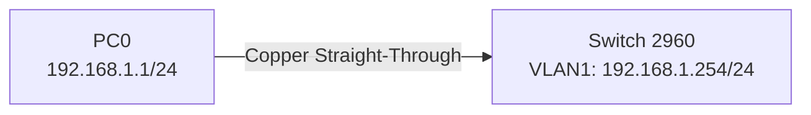

# 学生实验/学习任务卡

**课题名称：** 实验3 交换机基本配置
**课程：** 教学实践Ⅲ:计算机网络实验
**课时：** 实验 2 学时（120分钟）
**日期：** 第19周 第3课

---

## 一、学习目标

学完本次实验后，你将能够：

1. 说明交换机五种配置模式及其功能
2. 完成交换机名称、密码、管理IP配置
3. 配置VTY线路，实现Telnet远程登录
4. 使用show命令查看配置，并保存配置
5. 根据Telnet失败现象定位常见配置错误

---

## 二、背景知识

### 核心概念

| 概念 | 含义 | 类比 |
|---|---|---|
| 用户模式 | 只能查看少量基本信息 | 办公楼大厅 |
| 特权模式 | 可查看配置、保存配置、重启设备 | 管理员办公室 |
| 全局配置模式 | 修改设备整体配置 | 总控室 |
| 接口配置模式 | 修改某个接口配置 | 具体设备间 |
| 线路配置模式 | 修改远程登录线路配置 | 电话接待室 |
| VLAN1管理IP | 二层交换机用于被管理的IP地址 | 交换机办公室门牌号 |
| running-config | 当前运行配置 | 临时便签 |
| startup-config | 启动配置 | 正式档案 |

### 常用命令速查

```txt
Switch> enable
Switch# configure terminal
Switch(config)# hostname SW1
Switch(config)# enable secret class
Switch(config)# interface vlan 1
Switch(config-if)# ip address 192.168.1.254 255.255.255.0
Switch(config-if)# no shutdown
Switch(config)# line vty 0 15
Switch(config-line)# password cisco
Switch(config-line)# login
Switch# show running-config
Switch# copy running-config startup-config
```

### 命令辅助

```txt
?        查看当前可用命令或参数
Tab      自动补全命令
exit     返回上一层模式
end      直接返回特权模式
no ...   删除或关闭某条配置
```

---

## 三、实验拓扑



### 地址规划

| 设备 | 接口 | IP地址 | 子网掩码 |
|---|---|---|---|
| PC0 | FastEthernet0 | 192.168.1.1 | 255.255.255.0 |
| SW1 | VLAN1 | 192.168.1.254 | 255.255.255.0 |

---

## 四、实验任务

### 🔵 基础任务（必做，约30分钟）

**任务1：搭建拓扑**

1. 打开Packet Tracer。
2. 添加1台Cisco 2960交换机和1台PC。
3. 用直通线连接PC0和交换机任意FastEthernet端口。
4. 配置PC0的IP地址为`192.168.1.1/24`。

**任务2：记录IOS模式切换**

在交换机CLI中依次执行并记录提示符变化：

| 操作 | 命令 | 提示符 |
|---|---|---|
| 进入特权模式 | `enable` | |
| 进入全局配置模式 | `configure terminal` | |
| 进入接口配置模式 | `interface vlan 1` | |
| 返回上一层 | `exit` | |
| 进入线路配置模式 | `line vty 0 15` | |
| 返回特权模式 | `end` | |

**任务3：配置交换机名称和密码**

要求：

1. 将交换机命名为`SW1`。
2. 设置特权密码：`enable secret class`。
3. 使用`show running-config`查看配置是否生效。

记录关键配置片段：

```txt

```

### 🟡 进阶任务（必做，约30分钟）

**任务4：配置交换机管理IP**

在交换机上配置VLAN1管理IP：

```txt
interface vlan 1
ip address 192.168.1.254 255.255.255.0
no shutdown
```

验证：在PC0命令行执行：

```txt
ping 192.168.1.254
```

记录ping结果：

```txt

```

**任务5：配置Telnet远程登录**

在交换机上配置VTY线路：

```txt
line vty 0 15
password cisco
login
```

在PC0命令行执行：

```txt
telnet 192.168.1.254
```

记录登录结果：

```txt

```

**任务6：保存配置**

在特权模式执行：

```txt
copy running-config startup-config
```

然后使用以下命令查看：

```txt
show startup-config
```

记录保存是否成功：

```txt

```

### 🔴 挑战任务（选做，约10分钟）

从下面任选一种故障，先制造故障，再排查并修复：

1. 删除或关闭`interface vlan 1`。
2. 把PC0改成不同网段的IP。
3. 删除`line vty`下的`login`。
4. 修改VTY密码后用旧密码登录。

填写排查记录：

| 故障现象 | 可能原因 | 检查命令/方法 | 修复命令 |
|---|---|---|---|
| | | | |

---

## 五、思考题

1. 交换机有多少种配置模式？分别是什么？
2. 为了方便管理，交换机需要开通Telnet功能，应配置哪些内容？
3. 查看交换机当前所有配置信息用哪条命令？
4. 为什么交换机管理IP配置在`interface vlan 1`，而不是某个普通物理端口？
5. `running-config`和`startup-config`有什么区别？

---

## 六、提交要求

请在实验报告中提交：

1. 拓扑截图。
2. PC0 IP配置截图。
3. `show running-config`关键配置截图。
4. PC0 ping交换机管理IP的结果截图。
5. Telnet登录成功截图。
6. 思考题回答。
