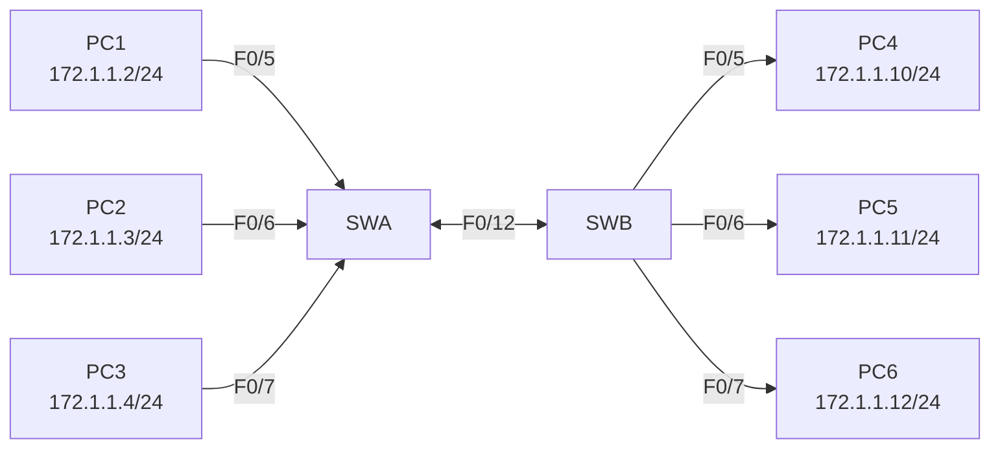

# 学生实验/学习任务卡

**课题名称：** 实验4 VLAN实验
**课程：** 教学实践Ⅲ:计算机网络实验
**课时：** 实验 2 学时（120分钟）
**日期：** 第19周 第4课

---

## 一、学习目标

学完本次实验后，你将能够：

1. 说明VLAN的作用和广播域隔离意义
2. 创建VLAN 2、VLAN 3、VLAN 4
3. 将交换机端口静态划入指定VLAN
4. 配置Trunk链路，实现同VLAN跨交换机通信
5. 使用`show vlan brief`和ping结果分析连通性

---

## 二、背景知识

### 核心概念

| 概念 | 含义 | 类比 |
|---|---|---|
| VLAN | 虚拟局域网，用于逻辑划分广播域 | 办公楼门禁分区 |
| 广播域 | 广播帧能够到达的范围 | 一次广播能通知到的人群 |
| Access端口 | 连接PC等终端，只属于一个VLAN | 普通员工门 |
| Trunk端口 | 连接交换机，可承载多个VLAN | 物流电梯 |
| VLAN间通信 | 不同VLAN之间的通信，需要三层设备 | 不同门禁区要通过前台审批 |

### 常用命令速查

```txt
Switch# configure terminal
Switch(config)# vlan 2
Switch(config-vlan)# name vlan2
Switch(config)# interface f0/5
Switch(config-if)# switchport mode access
Switch(config-if)# switchport access vlan 2
Switch# show vlan brief
Switch(config)# interface f0/12
Switch(config-if)# switchport mode trunk
Switch# show interfaces trunk
```

---

## 三、实验拓扑



### 端口与地址规划

| 主机 | 所接交换机 | 接口 | VLAN | IP地址 | 子网掩码 |
|---|---|---|:---:|---|---|
| PC1 | SWA | F0/5 | 2 | 172.1.1.2 | 255.255.255.0 |
| PC2 | SWA | F0/6 | 3 | 172.1.1.3 | 255.255.255.0 |
| PC3 | SWA | F0/7 | 4 | 172.1.1.4 | 255.255.255.0 |
| PC4 | SWB | F0/5 | 2 | 172.1.1.10 | 255.255.255.0 |
| PC5 | SWB | F0/6 | 3 | 172.1.1.11 | 255.255.255.0 |
| PC6 | SWB | F0/7 | 4 | 172.1.1.12 | 255.255.255.0 |

---

## 四、实验任务

### 🔵 基础任务（必做，约30分钟）

**任务1：搭建拓扑并配置PC地址**

1. 添加2台Cisco 2960交换机，分别命名为SWA、SWB。
2. 添加6台PC并按拓扑连接。
3. 按表格配置6台PC的IP地址和子网掩码。
4. 在未划分VLAN前，测试PC之间通信，记录结果。

记录：

| 测试 | 结果 |
|---|---|
| PC1 ping PC2 | |
| PC1 ping PC4 | |
| PC2 ping PC5 | |

**任务2：创建VLAN**

在SWA和SWB上分别创建VLAN 2、VLAN 3、VLAN 4。

SWA示例：

```txt
configure terminal
vlan 2
name vlan2
exit
vlan 3
name vlan3
exit
vlan 4
name vlan4
exit
```

SWB也执行同样配置。

**任务3：划分Access端口**

在SWA上：

```txt
interface f0/5
switchport mode access
switchport access vlan 2
exit
interface f0/6
switchport mode access
switchport access vlan 3
exit
interface f0/7
switchport mode access
switchport access vlan 4
exit
```

在SWB上同样将F0/5、F0/6、F0/7分别划入VLAN 2、VLAN 3、VLAN 4。

**任务4：查看VLAN配置**

执行：

```txt
show vlan brief
```

记录SWA结果：

| VLAN | Name | Ports |
|---|---|---|
| 2 | | |
| 3 | | |
| 4 | | |

记录SWB结果：

| VLAN | Name | Ports |
|---|---|---|
| 2 | | |
| 3 | | |
| 4 | | |

### 🟡 进阶任务（必做，约35分钟）

**任务5：配置Trunk链路**

用F0/12连接SWA和SWB，并在两端配置：

```txt
interface f0/12
switchport mode trunk
```

查看Trunk：

```txt
show interfaces trunk
```

**任务6：连通性验证矩阵**

完成以下ping测试：

| 测试 | 预期 | 实际结果 | 原因分析 |
|---|---|---|---|
| PC1 ping PC4 | 通 | | |
| PC2 ping PC5 | 通 | | |
| PC3 ping PC6 | 通 | | |
| PC1 ping PC2 | 不通 | | |
| PC4 ping PC5 | 不通 | | |
| PC1 ping PC5 | 不通 | | |

### 🔴 挑战任务（选做，约10分钟）

**任务7：删除VLAN并观察变化**

任选一台交换机，尝试删除VLAN 2或VLAN 3：

```txt
no vlan 2
```

观察：

1. `show vlan brief`中VLAN是否还存在？
2. 原来属于该VLAN的端口状态有什么变化？
3. 对应PC的ping结果有什么变化？

**任务8：比较两种跨交换机方案**

比较以下两种方案：

| 方案 | 说明 | 优点 | 缺点 |
|---|---|---|---|
| 多条Access线 | 每个VLAN一条交换机间连接线 | | |
| 一条Trunk线 | 一条链路承载多个VLAN | | |

---

## 五、思考题

1. 为什么划分VLAN后，PC1和PC2即使在同一IP网段也不能互相Ping通？
2. 为什么PC1和PC4配置在同一VLAN后可以跨交换机Ping通？
3. Access端口和Trunk端口有什么区别？
4. 如果把VLAN 2、VLAN 3、VLAN 4都删除了，两个交换机只连一条线，六台PC能互相访问吗？如果不能，如何设置才能互相访问？
5. 不同VLAN之间如果要互通，需要什么设备或技术？

---

## 六、提交要求

请在实验报告中提交：

1. 完整拓扑截图。
2. 6台PC的IP配置截图或地址表。
3. SWA和SWB的`show vlan brief`截图。
4. Trunk配置截图或`show interfaces trunk`截图。
5. 连通性验证矩阵。
6. 思考题回答。
7. Packet Tracer `.pkt`文件。
