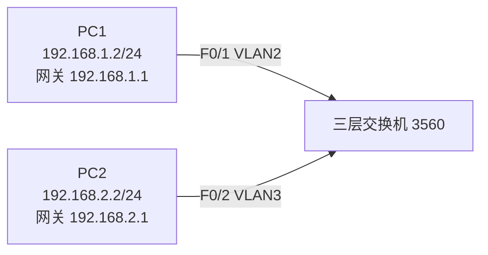
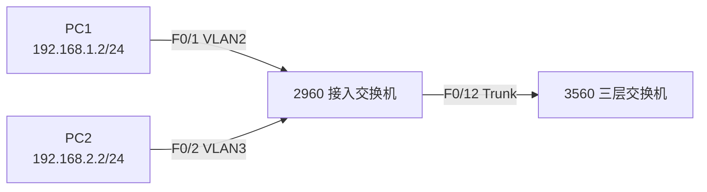

# 实验5 三层交换机的配置

## 学习目标

学完本次实验后，你将能够：

1. 说明三层交换机的作用，区分二层交换机、三层交换机与路由器
2. 通过SVI（交换机虚拟接口）方式实现不同VLAN之间的路由
3. 正确配置PC的IP地址和默认网关，并验证跨VLAN连通性
4. 使用`show ip route`、`show vlan brief`排查VLAN间路由问题
5. （选做）了解`no switchport`三层端口方式与三层+二层联合拓扑

## 背景知识

### 核心概念

| 概念 | 含义 | 类比 |
|---|---|---|
| 三层交换机 | 兼具二层交换和三层路由功能的交换机 | 带前台的门禁大楼 |
| SVI | 交换机虚拟接口，作为某个VLAN的三层网关 | 每个楼层的接待台 |
| `ip routing` | 启用三层交换机的路由功能 | 打开大楼内部导航系统 |
| 默认网关 | 主机访问其他网段时首先转发的IP地址 | 出门办事要找的前台 |
| `no switchport` | 关闭端口二层功能，使其成为三层路由端口 | 把普通门改成独立办公室入口 |
| VLAN间路由 | 不同VLAN之间的三层通信 | 不同门禁区通过前台互访 |

### 关键命令速查

```txt
Switch# configure terminal
Switch(config)# vlan 2
Switch(config-vlan)# exit
Switch(config)# interface f0/1
Switch(config-if)# switchport mode access
Switch(config-if)# switchport access vlan 2
Switch(config-if)# exit
Switch(config)# interface vlan 2
Switch(config-if)# ip address 192.168.1.1 255.255.255.0
Switch(config-if)# exit
Switch(config)# ip routing
Switch(config)# end
Switch# show vlan brief
Switch# show ip route
```

## 实验拓扑

### 基础拓扑（单台三层交换机）



### 地址与端口规划

| 主机 | 接口 | VLAN | IP地址 | 子网掩码 | 默认网关 |
|---|---|:---:|---|---|---|
| PC1 | F0/1 | 2 | 192.168.1.2 | 255.255.255.0 | 192.168.1.1 |
| PC2 | F0/2 | 3 | 192.168.2.2 | 255.255.255.0 | 192.168.2.1 |

### SVI 规划

| VLAN | SVI接口 | IP地址 | 作用 |
|---|---|---|---|
| VLAN 2 | interface vlan 2 | 192.168.1.1/24 | VLAN 2 的默认网关 |
| VLAN 3 | interface vlan 3 | 192.168.2.1/24 | VLAN 3 的默认网关 |

## 实验任务

### 基础任务（必做，约35分钟）

#### 任务1：搭建拓扑并配置PC地址

1. 添加1台Cisco 3560三层交换机。
2. 添加2台PC，分别连接到F0/1和F0/2。
3. 按表格配置PC1、PC2的IP地址、子网掩码和默认网关。

记录：

| 主机 | IP地址 | 子网掩码 | 默认网关 |
|---|---|---|---|
| PC1 | 192.168.1.2 | 255.255.255.0 | 192.168.1.1 |
| PC2 | 192.168.2.2 | 255.255.255.0 | 192.168.2.1 |

#### 任务2：创建VLAN并划分Access端口

在3560上：

```txt
configure terminal
vlan 2
name vlan2
exit
vlan 3
name vlan3
exit
interface f0/1
switchport mode access
switchport access vlan 2
exit
interface f0/2
switchport mode access
switchport access vlan 3
exit
end
```

查看VLAN：

```txt
show vlan brief
```

记录结果：

| VLAN | Name | Ports |
|---|---|---|
| 2 | | |
| 3 | | |

#### 任务3：配置SVI接口并启用路由

```txt
configure terminal
interface vlan 2
ip address 192.168.1.1 255.255.255.0
exit
interface vlan 3
ip address 192.168.2.1 255.255.255.0
exit
ip routing
end
```

查看路由表：

```txt
show ip route
```

记录关键输出：

```txt
C    192.168.1.0/24 is directly connected, Vlan2
C    192.168.2.0/24 is directly connected, Vlan3
```

#### 任务4：验证VLAN间通信

| 测试 | 预期结果 | 实际结果 | 原因分析 |
|---|---|---|---|
| PC1 ping PC2 | 通 | | 三层交换机提供VLAN间路由 |
| PC1 ping 192.168.1.1 | 通 | | SVI接口UP |
| PC2 ping 192.168.2.1 | 通 | | SVI接口UP |

### 进阶任务（必做，约35分钟）

#### 任务5：关闭`ip routing`观察变化

1. 在3560上执行：

```txt
configure terminal
no ip routing
end
```

2. 再次查看路由表：

```txt
show ip route
```

3. 测试PC1 ping PC2，记录结果：

| `ip routing` 状态 | PC1 ping PC2 | 原因 |
|---|---|---|
| 开启 | 通 | |
| 关闭 | 不通 | |

4. 恢复路由功能：

```txt
configure terminal
ip routing
end
```

#### 任务6：SVI 与 `no switchport` 方式对比

阅读以下配置，填写对比表：

```txt
! 方式A：SVI
interface f0/1
 switchport mode access
 switchport access vlan 2
 exit
interface vlan 2
 ip address 192.168.1.1 255.255.255.0

! 方式B：no switchport
interface f0/1
 no switchport
 ip address 192.168.1.1 255.255.255.0
```

| 对比项 | SVI方式 | `no switchport`方式 |
|---|---|---|
| 是否需要创建VLAN | | |
| 是否使用物理端口IP | | |
| 一个端口能否承载多个VLAN | | |
| 适用场景 | VLAN间路由 | 点到点三层连接 |

### 挑战任务（选做，约10分钟）

#### 任务7：三层+二层联合配置

拓扑：



要求：

1. 3560配置为VTP Server，2960配置为VTP Client，domain名为`abc`。
2. 3560创建VLAN 2/3，2960通过VTP学习VLAN。
3. 互联端口F0/12配置为Trunk。
4. 2960的F0/1划入VLAN 2，F0/2划入VLAN 3。
5. 3560配置SVI作为VLAN 2/3的网关。
6. 验证PC1与PC2跨VLAN通信。

提示命令：

```txt
! 3560 VTP Server
vlan database
vtp domain abc
vtp server
exit

! 2960 VTP Client
vlan database
vtp domain abc
vtp client
exit
```

## 思考题

1. 三层交换机和普通二层交换机有什么区别？
2. 三层交换机和路由器有什么区别？
3. 如果把PC1的默认网关留空，PC1还能ping通PC2吗？为什么？
4. 配置SVI后，为什么必须执行`ip routing`？
5. 如果把PC2改接到F0/3（未划入VLAN 3），PC1还能ping通PC2吗？为什么？
6. SVI方式和`no switchport`方式各适用于什么场景？

## 提交要求

请在实验报告中提交：

1. 完整拓扑截图。
2. PC1、PC2的IP配置截图或地址表。
3. `show vlan brief`截图。
4. `show ip route`截图。
5. 跨VLAN ping测试结果截图。
6. 思考题回答。
7. Packet Tracer `.pkt`文件。
