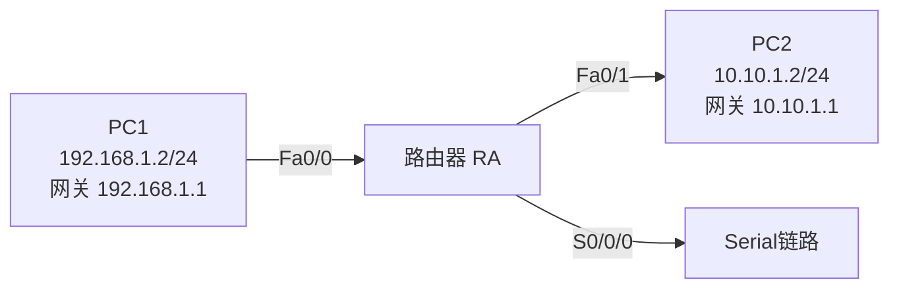
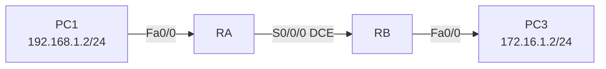

## 一、学习目标

学完本次实验后，你将能够：

1. 说明路由器的作用，区分路由器与二层交换机、三层交换机
2. 在Cisco路由器上配置主机名、Ethernet接口IP地址并激活接口
3. 配置PC的IP地址和默认网关，验证跨网段连通性
4. 配置Serial接口（含`clock rate`）和Telnet远程登录
5. 使用`show ip interface brief`等命令查看接口状态
6. （选做）完成两台路由器通过Serial链路互联

## 二、背景知识

### 核心概念

| 概念 | 含义 | 类比 |
|---|---|---|
| 路由器 | 工作在网络层，连接不同网络并根据IP地址转发数据包 | 连接不同城市的机场 |
| 接口 | 路由器上的物理或逻辑端口，每个接口通常属于一个子网 | 机场的登机口 |
| 默认网关 | PC访问其他网段时首先转发的IP地址 | 出城先去本地机场 |
| `no shutdown` | 激活接口的管理命令 | 打开登机口 |
| DCE/DTE | 串行链路的两端角色，DCE提供时钟信号 | 音乐会指挥与乐手 |
| `clock rate` | DCE端配置的时钟速率命令 | 指挥给出的节拍 |
| Telnet | 远程登录协议，用于网络设备管理 | 远程进入机场控制室 |

### 关键命令速查

```txt
Router> enable
Router# configure terminal
Router(config)# hostname RA
RA(config)# interface fastethernet 0/0
RA(config-if)# ip address 192.168.1.1 255.255.255.0
RA(config-if)# no shutdown
RA(config-if)# exit
RA(config)# interface serial 0/0/0
RA(config-if)# ip address 172.159.1.1 255.255.255.0
RA(config-if)# clock rate 64000
RA(config-if)# no shutdown
RA(config-if)# exit
RA(config)# line vty 0 4
RA(config-line)# login
RA(config-line)# password star
RA(config-line)# exit
RA(config)# enable secret abc
RA(config)# end
RA# show ip interface brief
RA# show running-config
RA# write memory
```

## 三、实验拓扑

### 基础拓扑（单台路由器）



### 地址与接口规划

| 设备 | 接口 | IP地址 | 子网掩码 | 默认网关 |
|---|---|---|---|---|
| RA | Fa0/0 | 192.168.1.1 | 255.255.255.0 | — |
| RA | Fa0/1 | 10.10.1.1 | 255.255.255.0 | — |
| RA | S0/0/0 | 172.159.1.1 | 255.255.255.0 | — |
| PC1 | — | 192.168.1.2 | 255.255.255.0 | 192.168.1.1 |
| PC2 | — | 10.10.1.2 | 255.255.255.0 | 10.10.1.1 |

## 四、实验任务

### 🔵 基础任务（必做，约40分钟）

**任务1：搭建拓扑并配置PC地址**

1. 添加1台Cisco路由器（如2911或Generic）。
2. 添加2台PC，分别连接到路由器的Fa0/0和Fa0/1。
3. 按表格配置PC1、PC2的IP地址、子网掩码和默认网关。

记录：

| 主机 | IP地址 | 子网掩码 | 默认网关 |
|---|---|---|---|
| PC1 | 192.168.1.2 | 255.255.255.0 | 192.168.1.1 |
| PC2 | 10.10.1.2 | 255.255.255.0 | 10.10.1.1 |

**任务2：配置路由器主机名和Ethernet接口**

在路由器上：

```txt
enable
configure terminal
hostname RA
interface fastethernet 0/0
ip address 192.168.1.1 255.255.255.0
no shutdown
exit
interface fastethernet 0/1
ip address 10.10.1.1 255.255.255.0
no shutdown
exit
end
```

查看接口状态：

```txt
show ip interface brief
```

记录结果：

| 接口 | IP地址 | Status | Protocol |
|---|---|---|---|
| Fa0/0 | | | |
| Fa0/1 | | | |

**任务3：验证跨网段通信**

| 测试 | 预期结果 | 实际结果 | 原因分析 |
|---|---|---|---|
| PC1 ping 192.168.1.1 | 通 | | 网关可达 |
| PC1 ping 10.10.1.1 | 通 | | 跨网段网关可达 |
| PC1 ping PC2（10.10.1.2） | 通 | | 路由器跨网段转发 |
| PC2 ping PC1（192.168.1.2） | 通 | | 路由器跨网段转发 |

### 🟡 进阶任务（必做，约30分钟）

**任务4：配置Serial接口**

如果路由器没有Serial接口，先关闭电源，添加WIC-1T串口模块，再重新开启电源。

```txt
configure terminal
interface serial 0/0/0
ip address 172.159.1.1 255.255.255.0
clock rate 64000
no shutdown
exit
end
```

查看接口状态：

```txt
show ip interface brief
```

记录Serial接口状态：

| 接口 | IP地址 | Status | Protocol | DCE/DTE |
|---|---|---|---|---|
| S0/0/0 | | | | |

**任务5：配置Telnet远程登录和特权密码**

```txt
configure terminal
line vty 0 4
login
password star
exit
enable secret abc
end
```

在PC1上测试Telnet：

```txt
PC> telnet 192.168.1.1
Password: star
RA> enable
Password: abc
RA#
```

记录测试结果：

| 测试 | 预期结果 | 实际结果 |
|---|---|---|
| PC1 Telnet到RA | 成功 | |
| 输入line vty密码后进入用户模式 | 成功 | |
| 输入enable secret后进入特权模式 | 成功 | |

**任务6：保存配置**

```txt
RA# write memory
```

验证启动配置：

```txt
RA# show startup-config
```

### 🔴 挑战任务（选做，约15分钟）

**任务7：两台路由器通过Serial链路互联**

拓扑：



要求：

1. RA的S0/0/0配置为DCE，IP为172.159.1.1/24，`clock rate 64000`。
2. RB的S0/0/0配置为DTE，IP为172.159.1.2/24，不配`clock rate`。
3. 配置PC3的IP为172.16.1.2/24，网关为RB的Fa0/0接口IP 172.16.1.1。
4. 在RA上ping RB的Serial接口IP，验证Serial链路连通。
5. 尝试从RA Telnet到RB（`telnet 172.159.1.2`）。

提示：此时PC1与PC3还不能互通，因为还没有配置路由，下节课学习。

## 五、思考题

1. 路由器有多少种配置模式？如何切换？
2. 为什么路由器的两个Ethernet接口不能配置在同一个子网？
3. 如果忘记执行`no shutdown`，会出现什么现象？
4. Serial链路中为什么只有DCE端需要配置`clock rate`？
5. 配置Telnet远程登录需要哪些命令？如果不设置密码，能否Telnet登录？
6. `enable secret`和`enable password`有什么区别？实际配置中推荐使用哪一个？
7. 为什么PC1能ping通PC2？数据包经过了哪些设备？

## 六、提交要求

请在实验报告中提交：

1. 完整拓扑截图。
2. 路由器`show ip interface brief`截图。
3. PC1、PC2的IP配置截图或地址表。
4. PC1 ping PC2的测试结果截图。
5. Telnet登录和进入特权模式的截图（进阶）。
6. 思考题回答。
7. Packet Tracer `.pkt`文件。
