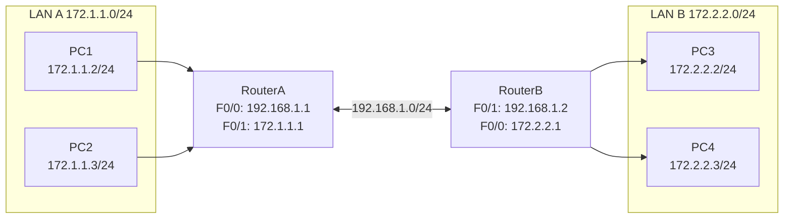
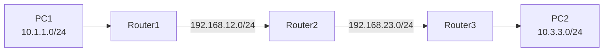

## 一、学习目标

学完本次实验后，你将能够：

1. 说明路由表的作用，区分直连路由和静态路由
2. 在Cisco路由器上配置静态路由和默认路由
3. 正确选择下一跳IP地址
4. 使用`show ip route`、`ping`、`tracert`验证路由
5. （选做）完成三台路由器的链式拓扑静态路由配置

## 二、背景知识

### 核心概念

| 概念 | 含义 | 类比 |
|---|---|---|
| 路由表 | 路由器用于决策数据包转发路径的表 | 路口的路牌集合 |
| 直连路由 | 路由器接口直接连接的网络 | 家门口的街道 |
| 静态路由 | 管理员手工配置的路由条目 | 手写路牌 |
| 下一跳 | 到达目标网络应交给的下一个路由器接口IP | 下一站地址 |
| 默认路由 | 目标为0.0.0.0/0的兜底路由 | "其他方向请直行" |
| 管理距离 | 路由来源的可信度，静态路由默认为1 | 路牌的可信等级 |

### 关键命令速查

```txt
! 查看路由表
Router# show ip route

! 配置静态路由
Router(config)# ip route 目标网络 子网掩码 下一跳IP

! 配置默认路由
Router(config)# ip route 0.0.0.0 0.0.0.0 下一跳IP

! 追踪路径
PC> tracert 目标IP
```

## 三、实验拓扑

### 基础拓扑（两台路由器）



### 地址与接口规划

| 设备 | 接口 | IP地址 | 子网掩码 | 默认网关 |
|---|---|---|---|---|
| RouterA | F0/0 | 192.168.1.1 | 255.255.255.0 | — |
| RouterA | F0/1 | 172.1.1.1 | 255.255.255.0 | — |
| RouterB | F0/1 | 192.168.1.2 | 255.255.255.0 | — |
| RouterB | F0/0 | 172.2.2.1 | 255.255.255.0 | — |
| PC1 | — | 172.1.1.2 | 255.255.255.0 | 172.1.1.1 |
| PC2 | — | 172.1.1.3 | 255.255.255.0 | 172.1.1.1 |
| PC3 | — | 172.2.2.2 | 255.255.255.0 | 172.2.2.1 |
| PC4 | — | 172.2.2.3 | 255.255.255.0 | 172.2.2.1 |

## 四、实验任务

### 🔵 基础任务（必做，约45分钟）

**任务1：搭建拓扑并配置PC地址**

1. 添加2台路由器（RouterA、RouterB）、2台交换机、4台PC。
2. 按表格配置所有PC的IP地址、子网掩码和默认网关。
3. 按表格配置路由器接口IP，并执行`no shutdown`。

记录：

| 主机 | IP地址 | 子网掩码 | 默认网关 |
|---|---|---|---|
| PC1 | 172.1.1.2 | 255.255.255.0 | 172.1.1.1 |
| PC2 | 172.1.1.3 | 255.255.255.0 | 172.1.1.1 |
| PC3 | 172.2.2.2 | 255.255.255.0 | 172.2.2.1 |
| PC4 | 172.2.2.3 | 255.255.255.0 | 172.2.2.1 |

**任务2：查看初始路由表**

在 RouterA 和 RouterB 上分别执行：

```txt
show ip route
```

记录：

| 路由器 | 路由代码 | 目标网络 | 类型 |
|---|---|---|---|
| RouterA | C | | |
| RouterA | C | | |
| RouterB | C | | |
| RouterB | C | | |

**任务3：配置静态路由**

在 RouterA 上：

```txt
configure terminal
ip route 172.2.2.0 255.255.255.0 192.168.1.2
end
```

在 RouterB 上：

```txt
configure terminal
ip route 172.1.1.0 255.255.255.0 192.168.1.1
end
```

查看路由表：

```txt
show ip route
```

记录新增条目：

| 路由器 | 路由代码 | 目标网络 | 下一跳 |
|---|---|---|---|
| RouterA | S | 172.2.2.0/24 | 192.168.1.2 |
| RouterB | S | 172.1.1.0/24 | 192.168.1.1 |

**任务4：验证连通性**

| 测试 | 预期结果 | 实际结果 | 原因分析 |
|---|---|---|---|
| PC1 ping PC3 | 通 | | 双向静态路由正确 |
| PC1 ping PC4 | 通 | | 同上 |
| PC3 ping PC1 | 通 | | 同上 |
| PC3 ping PC2 | 通 | | 同上 |

### 🟡 进阶任务（必做，约30分钟）

**任务5：配置默认路由**

假设 RouterB 是通往外部网络的出口，在 RouterA 上配置默认路由：

```txt
RouterA(config)# ip route 0.0.0.0 0.0.0.0 192.168.1.2
```

查看路由表，记录默认路由条目：

```txt
S* 0.0.0.0/0 [1/0] via 192.168.1.2
```

**任务6：使用 tracert 观察路径**

在 PC1 上：

```txt
PC> tracert 172.2.2.2
```

记录每一跳的IP：

| 跳数 | IP地址 | 设备 |
|---|---|---|
| 1 | 172.1.1.1 | RouterA |
| 2 | 172.2.2.2 | PC3 |

### 🔴 挑战任务（选做，约15分钟）

**任务7：三路由器链式拓扑**

拓扑：



要求：

1. 为三个LAN和两条互联链路分配IP地址。
2. 在每个路由器上配置静态路由，使 PC1 和 PC2 互通。
3. 思考：中间路由器Router2需要几条静态路由？

## 五、思考题

1. 静态路由有什么优点？
2. 为什么两台路由器连上后，各自LAN不能自动互通？
3. 配置静态路由时，下一跳IP应该写谁的地址？
4. 如果只配了去程路由没配回程路由，会出现什么现象？
5. 默认路由与具体静态路由的优先级如何判断？
6. `show ip route`输出中`[1/0]`表示什么？

## 六、提交要求

请在实验报告中提交：

1. 完整拓扑截图。
2. RouterA 和 RouterB 的`show ip route`截图。
3. PC1 ping PC3 的测试结果截图。
4. `tracert`结果截图（进阶）。
5. 思考题回答。
6. Packet Tracer `.pkt`文件。
