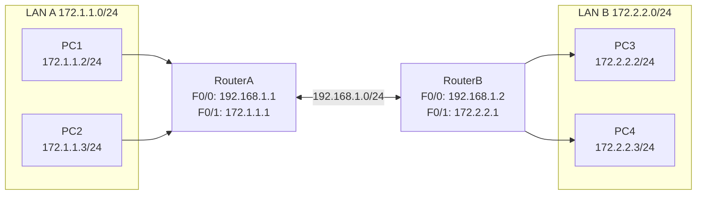
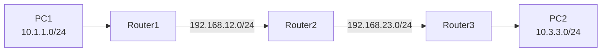

## 一、学习目标

学完本次实验后，你将能够：

1. 说明RIP协议的工作原理（距离矢量、跳数、更新周期）
2. 区分RIPv1与RIPv2的核心差异
3. 在Cisco路由器上配置RIPv2动态路由
4. 使用`show ip route`、`show ip protocols`、`ping`验证RIP路由
5. （选做）完成三台路由器的链式拓扑RIP配置

## 二、背景知识

### 核心概念

| 概念 | 含义 | 类比 |
|---|---|---|
| 动态路由 | 路由器通过协议自动交换和学习路由信息 | 小区公告栏互相抄录 |
| 距离矢量 | 路由协议类型，只传递方向和距离 | 楼长只告诉邻居"某栋楼距离我几栋" |
| 跳数（Hop） | 数据包到达目标网络需要经过的路由器数量 | 经过几栋楼 |
| RIPv1 | 第一代RIP，不发送子网掩码，广播更新 | 旧版公告栏，不写门牌号范围 |
| RIPv2 | 第二代RIP，发送子网掩码，组播更新 | 新版公告栏，信息更完整 |
| 收敛 | 所有路由器的路由表达到一致的过程 | 所有楼长的公告栏内容同步 |
| 管理距离（AD） | 路由来源的可信度，RIP默认为120 | 公告栏信息的可信等级 |

### 关键命令速查

```txt
! 进入RIP配置模式
Router(config)# router rip

! 指定RIP版本
Router(config-router)# version 2

! 宣告直连网段（注意：是网段地址，不是接口IP）
Router(config-router)# network 192.168.1.0

! 查看路由表
Router# show ip route

! 查看RIP协议状态
Router# show ip protocols

! 删除RIP配置
Router(config)# no router rip
```

## 三、实验拓扑

### 基础拓扑（两台路由器）



### 地址与接口规划（与教材实验12一致）

| 设备 | 接口 | IP地址 | 子网掩码 | 默认网关 |
|---|---|---|---|---|
| RouterA | F0/0 | 192.168.1.1 | 255.255.255.0 | — |
| RouterA | F0/1 | 172.1.1.1 | 255.255.255.0 | — |
| RouterB | F0/0 | 192.168.1.2 | 255.255.255.0 | — |
| RouterB | F0/1 | 172.2.2.1 | 255.255.255.0 | — |
| PC1 | — | 172.1.1.2 | 255.255.255.0 | 172.1.1.1 |
| PC2 | — | 172.1.1.3 | 255.255.255.0 | 172.1.1.1 |
| PC3 | — | 172.2.2.2 | 255.255.255.0 | 172.2.2.1 |
| PC4 | — | 172.2.2.3 | 255.255.255.0 | 172.2.2.1 |

## 四、实验任务

### 🔵 基础任务（必做，约45分钟）

**任务1：搭建拓扑并配置PC地址**

1. 添加2台路由器（RouterA、RouterB）、2台交换机、4台PC。
2. 按表格配置所有PC的IP地址、子网掩码和默认网关。
3. 按表格配置路由器接口IP，并执行`no shutdown`。

记录：

| 主机 | IP地址 | 子网掩码 | 默认网关 |
|---|---|---|---|
| PC1 | 172.1.1.2 | 255.255.255.0 | 172.1.1.1 |
| PC2 | 172.1.1.3 | 255.255.255.0 | 172.1.1.1 |
| PC3 | 172.2.2.2 | 255.255.255.0 | 172.2.2.1 |
| PC4 | 172.2.2.3 | 255.255.255.0 | 172.2.2.1 |

**任务2：查看初始路由表**

在 RouterA 和 RouterB 上分别执行：

```txt
show ip route
```

记录：

| 路由器 | 路由代码 | 目标网络 | 类型 |
|---|---|---|---|
| RouterA | C | | |
| RouterA | C | | |
| RouterB | C | | |
| RouterB | C | | |

**任务3：配置RIPv2**

在 RouterA 上：

```txt
configure terminal
router rip
version 2
network 172.1.1.0
network 192.168.1.0
end
```

在 RouterB 上：

```txt
configure terminal
router rip
version 2
network 172.2.2.0
network 192.168.1.0
end
```

> ⚠️ **注意**：`network`后面写的是**网段地址**（如`192.168.1.0`），不是接口IP（如`192.168.1.1`）！

查看路由表：

```txt
show ip route
```

记录新增条目：

| 路由器 | 路由代码 | 目标网络 | 下一跳 | AD/Metric |
|---|---|---|---|---|
| RouterA | R | 172.2.2.0/24 | 192.168.1.2 | 120/1 |
| RouterB | R | 172.1.1.0/24 | 192.168.1.1 | 120/1 |

**任务4：验证连通性**

| 测试 | 预期结果 | 实际结果 | 原因分析 |
|---|---|---|---|
| PC1 ping PC3 | 通 | | RIP自动学习路由 |
| PC1 ping PC4 | 通 | | 同上 |
| PC3 ping PC1 | 通 | | 同上 |
| PC3 ping PC2 | 通 | | 同上 |

### 🟡 进阶任务（必做，约30分钟）

**任务5：对比RIPv1与RIPv2**

填写对比表格：

| 对比项 | RIPv1 | RIPv2 |
|---|---|---|
| 子网掩码 | | |
| CIDR支持 | | |
| 更新方式 | | |
| 认证 | | |
| 推荐程度 | | |

**任务6：使用`show ip protocols`查看RIP状态**

在 RouterA 上：

```txt
show ip protocols
```

记录关键参数：

| 参数 | 值 | 含义 |
|---|---|---|
| 更新周期 | | |
| 失效时间 | | |
| 版本控制 | | |
| 宣告网段 | | |
| 邻居信息 | | |

**任务7：理解`[120/1]`含义**

- `[120/1]`中，120 = ________，1 = ________
- 与静态路由的`[1/0]`对比：静态路由AD=________，Metric=________
- 结论：当同时存在静态路由和RIP路由时，________优先（因为AD更小）

### 🔴 挑战任务（选做，约15分钟）

**任务8：三路由器链式拓扑**

拓扑：



要求：

1. 为三个LAN和两条互联链路分配IP地址。
2. 在每个路由器上配置RIPv2，使用`network`宣告所有直连网段。
3. 观察`show ip route`中跳数（Metric）的变化。
4. 思考：从PC1到PC3，跳数是多少？如果链长达到16跳会怎样？

## 五、思考题

1. RIP协议有什么优点？与静态路由相比最大的区别是什么？
2. 为什么`network`命令后面要写网段地址而不是接口IP？
3. RIPv1和RIPv2的主要区别是什么？为什么实验中使用`version 2`？
4. `show ip route`输出中`[120/1]`表示什么？如果跳数变成16会怎样？
5. 如果网络中同时存在静态路由和RIP路由，路由器会优先选择哪一条？为什么？
6. RIP的更新周期是多少？配置完后为什么有时需要稍等才能ping通？

## 六、提交要求

请在实验报告中提交：

1. 完整拓扑截图。
2. RouterA 和 RouterB 的`show ip route`截图（需包含R条目）。
3. PC1 ping PC3 的测试结果截图。
4. `show ip protocols`结果截图（进阶）。
5. RIPv1 vs RIPv2对比表格（进阶）。
6. 思考题回答。
7. Packet Tracer `.pkt`文件。
