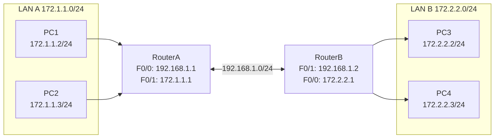
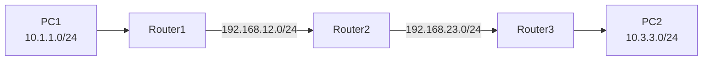

## 一、学习目标

学完本次实验后，你将能够：

1. 说明OSPF链路状态工作原理，区分链路状态与距离向量路由协议
2. 在Cisco路由器上配置单区域OSPF（`router ospf`、`network`、通配符掩码）
3. 使用`show ip route`、`show ip ospf neighbor`验证OSPF配置
4. 对比OSPF与RIP在路由表输出、管理距离、度量方式上的差异
5. （选做）完成三台路由器的OSPF配置，观察DR/BDR选举

## 二、背景知识

### 核心概念

| 概念 | 含义 | 类比 |
|---|---|---|
| 链路状态（Link-State） | 每台路由器维护完整网络拓扑地图，自己计算最短路径 | 每个路口都有一份完整城市地图 |
| 距离向量（Distance-Vector） | 路由器只听说"到某地去要几跳"，信息层层传递 | 路人互相打听路线 |
| 进程ID | OSPF进程标识，只在本地有意义 | 公司内部部门编号 |
| 通配符掩码 | 与子网掩码相反，0表示"必须匹配" | 筛子的孔径 |
| 区域（Area） | OSPF将网络划分为多个区域管理 | 城市的行政区 |
| Cost | OSPF度量标准，与带宽成反比 | 路况评分（路越宽分越低） |
| DR/BDR | 指定路由器/备份指定路由器，减少邻接关系数量 | 班级选班长和副班长 |

### 关键命令速查

```txt
! 启动OSPF进程
Router(config)# router ospf 进程ID

! 将网段加入OSPF区域
Router(config-router)# network 网络地址 通配符掩码 area 区域号

! 查看OSPF邻居
Router# show ip ospf neighbor

! 查看OSPF接口信息（含Cost）
Router# show ip ospf interface

! 查看路由协议配置
Router# show ip protocols

! 查看路由表
Router# show ip route

! 重置OSPF进程（加速收敛）
Router# clear ip ospf process
```

### 通配符掩码速查表

| 前缀长度 | 子网掩码 | 通配符掩码 |
|---|---|---|
| /24 | 255.255.255.0 | 0.0.0.255 |
| /16 | 255.255.0.0 | 0.0.255.255 |
| /30 | 255.255.255.252 | 0.0.0.3 |
| /32 | 255.255.255.255 | 0.0.0.0 |

## 三、实验拓扑

### 基础拓扑（两台路由器）



### 地址与接口规划

| 设备 | 接口 | IP地址 | 子网掩码 | 默认网关 |
|---|---|---|---|---|
| RouterA | F0/0 | 192.168.1.1 | 255.255.255.0 | — |
| RouterA | F0/1 | 172.1.1.1 | 255.255.255.0 | — |
| RouterB | F0/1 | 192.168.1.2 | 255.255.255.0 | — |
| RouterB | F0/0 | 172.2.2.1 | 255.255.255.0 | — |
| PC1 | — | 172.1.1.2 | 255.255.255.0 | 172.1.1.1 |
| PC2 | — | 172.1.1.3 | 255.255.255.0 | 172.1.1.1 |
| PC3 | — | 172.2.2.2 | 255.255.255.0 | 172.2.2.1 |
| PC4 | — | 172.2.2.3 | 255.255.255.0 | 172.2.2.1 |

## 四、实验任务

### 🔵 基础任务（必做，约45分钟）

**任务1：搭建拓扑并配置PC地址**

1. 添加2台路由器（RouterA、RouterB）、2台交换机、4台PC。
2. 按表格配置所有PC的IP地址、子网掩码和默认网关。
3. 按表格配置路由器接口IP，并执行`no shutdown`。

记录：

| 主机 | IP地址 | 子网掩码 | 默认网关 |
|---|---|---|---|
| PC1 | 172.1.1.2 | 255.255.255.0 | 172.1.1.1 |
| PC2 | 172.1.1.3 | 255.255.255.0 | 172.1.1.1 |
| PC3 | 172.2.2.2 | 255.255.255.0 | 172.2.2.1 |
| PC4 | 172.2.2.3 | 255.255.255.0 | 172.2.2.1 |

**任务2：查看初始路由表**

在 RouterA 和 RouterB 上分别执行：

```txt
show ip route
```

记录：

| 路由器 | 路由代码 | 目标网络 | 类型 |
|---|---|---|---|
| RouterA | C | | |
| RouterA | C | | |
| RouterB | C | | |
| RouterB | C | | |

**任务3：配置OSPF**

在 RouterA 上：

```txt
configure terminal
router ospf 100
network 172.1.1.0 0.0.0.255 area 0
network 192.168.1.0 0.0.0.255 area 0
end
```

在 RouterB 上：

```txt
configure terminal
router ospf 100
network 172.2.2.0 0.0.0.255 area 0
network 192.168.1.0 0.0.0.255 area 0
end
```

查看OSPF邻居关系：

```txt
show ip ospf neighbor
```

记录：

| 路由器 | 邻居ID | 状态 | 接口 |
|---|---|---|---|
| RouterA | | | |
| RouterB | | | |

查看路由表：

```txt
show ip route
```

记录新增条目：

| 路由器 | 路由代码 | 目标网络 | 下一跳 | 度量 |
|---|---|---|---|---|
| RouterA | O | 172.2.2.0/24 | | |
| RouterB | O | 172.1.1.0/24 | | |

**任务4：验证连通性**

| 测试 | 预期结果 | 实际结果 | 原因分析 |
|---|---|---|---|
| PC1 ping PC3 | 通 | | OSPF自动学习路由 |
| PC1 ping PC4 | 通 | | OSPF自动学习路由 |
| PC3 ping PC1 | 通 | | OSPF自动学习路由 |
| PC3 ping PC2 | 通 | | OSPF自动学习路由 |

### 🟡 进阶任务（必做，约30分钟）

**任务5：查看OSPF Cost值**

在 RouterA 上：

```txt
show ip ospf interface
```

记录各接口的Cost值：

| 接口 | IP地址 | Cost值 | 带宽 |
|---|---|---|---|
| F0/0 | | | |
| F0/1 | | | |

**任务6：对比OSPF与RIP**

填写协议对比表：

| 对比项 | OSPF | RIP |
|---|---|---|
| 路由代码 | O | R |
| 管理距离 | | |
| 度量标准 | | |
| 算法类型 | | |
| 更新方式 | | |
| 跳数限制 | | |

### 🔴 挑战任务（选做，约15分钟）

**任务7：三路由器链式拓扑**

拓扑：



要求：

1. 为三个LAN和两条互联链路分配IP地址。
2. 在每个路由器上配置OSPF（area 0），使 PC1 和 PC2 互通。
3. 观察DR/BDR选举结果（`show ip ospf neighbor`）。
4. 思考：中间路由器Router2需要几条`network`语句？

## 五、思考题

1. OSPF与RIP相比有哪些优势？
2. 通配符掩码和子网掩码有什么区别？如何快速计算通配符掩码？
3. OSPF的进程ID（如100）是否必须在所有路由器上相同？为什么？
4. 为什么单区域OSPF必须配置area 0？
5. `show ip route`中`[110/74]`的110和74分别表示什么？
6. 如果两台路由器的区域号不一致（一台area 0，一台area 1），会出现什么现象？

## 六、提交要求

请在实验报告中提交：

1. 完整拓扑截图。
2. RouterA 和 RouterB 的`show ip route`截图（含O条目）。
3. RouterA 或 RouterB 的`show ip ospf neighbor`截图。
4. PC1 ping PC3 的测试结果截图。
5. OSPF与RIP协议对比表（进阶）。
6. 思考题回答。
7. Packet Tracer `.pkt`文件。
