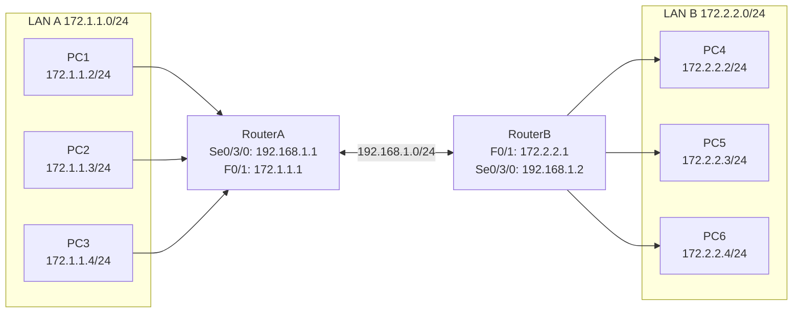

## 一、学习目标

学完本次实验后，你将能够：

1. 说明ACL的作用和工作原理
2. 区分标准ACL与扩展ACL
3. 配置标准ACL过滤基于源IP的流量
4. 将ACL应用到接口的in/out方向
5. 使用`show access-lists`验证ACL效果
6. （选做）配置禁止整个网段访问的标准ACL

## 二、背景知识

### 核心概念

| 概念 | 含义 | 类比 |
|---|---|---|
| ACL | 访问控制列表，用于过滤网络流量 | 门卫/门禁 |
| 标准ACL | 只根据源IP地址过滤 | 只看身份证 |
| 扩展ACL | 根据源IP、目的IP、协议、端口过滤 | 智能安检 |
| 通配符掩码 | 用于指定ACL中IP地址匹配范围 | 模糊匹配规则 |
| 隐式拒绝 | ACL末尾默认存在deny any | 没允许的都被拒绝 |
| in/out方向 | 相对于路由器接口的数据流方向 | 进门/出门 |

### 关键命令速查

```txt
! 创建标准ACL
Router(config)# access-list 1 deny 172.2.2.4 0.0.0.0
Router(config)# access-list 1 permit any

! 应用到接口
Router(config)# interface fastethernet 0/1
Router(config-if)# ip access-group 1 out

! 查看ACL
Router# show access-lists
Router# show ip interface fastethernet 0/1
```

## 三、实验拓扑



### 地址与接口规划

| 设备 | 接口 | IP地址 | 子网掩码 | 默认网关 |
|---|---|---|---|---|
| RouterA | Se0/3/0 | 192.168.1.1 | 255.255.255.0 | — |
| RouterA | F0/1 | 172.1.1.1 | 255.255.255.0 | — |
| RouterB | F0/1 | 172.2.2.1 | 255.255.255.0 | — |
| RouterB | Se0/3/0 | 192.168.1.2 | 255.255.255.0 | — |
| PC1 | — | 172.1.1.2 | 255.255.255.0 | 172.1.1.1 |
| PC2 | — | 172.1.1.3 | 255.255.255.0 | 172.1.1.1 |
| PC3 | — | 172.1.1.4 | 255.255.255.0 | 172.1.1.1 |
| PC4 | — | 172.2.2.2 | 255.255.255.0 | 172.2.2.1 |
| PC5 | — | 172.2.2.3 | 255.255.255.0 | 172.2.2.1 |
| PC6 | — | 172.2.2.4 | 255.255.255.0 | 172.2.2.1 |

## 四、实验任务

### 🔵 基础任务（必做，约45分钟）

**任务1：配置路由协议**

1. 搭建拓扑并配置所有接口IP。
2. 配置RIP或OSPF，使LAN A和LAN B的所有PC互通。
3. 验证：PC6能ping通PC1。

记录：

| 测试 | 预期结果 | 实际结果 |
|---|---|---|
| PC6 ping PC1 | 通 | |
| PC5 ping PC1 | 通 | |

**任务2：配置标准ACL**

在 RouterA 上：

```txt
configure terminal
access-list 1 deny 172.2.2.4 0.0.0.0
access-list 1 permit any
interface fastethernet 0/1
ip access-group 1 out
end
```

查看ACL：

```txt
show access-lists
```

记录输出：

```txt
Standard IP access list 1
    deny 172.2.2.4 (__ match(es))
    permit any (__ match(es))
```

**任务3：验证过滤效果**

| 测试 | 预期结果 | 实际结果 | 原因 |
|---|---|---|---|
| PC6 ping PC1 | 不通 | | ACL deny匹配 |
| PC6 ping PC2 | 不通 | | ACL deny匹配 |
| PC6 ping PC3 | 不通 | | ACL deny匹配 |
| PC5 ping PC1 | 通 | | ACL permit any |
| PC4 ping PC1 | 通 | | ACL permit any |

### 🟡 进阶任务（必做，约30分钟）

**任务4：观察匹配计数**

在PC6多次ping PC1后，再次查看`show access-lists`，记录deny规则的匹配次数变化。

| 时间 | deny匹配数 | permit匹配数 |
|---|---|---|
| 刚应用ACL | | |
| PC6 ping 5次后 | | |

**任务5：理解隐式deny**

临时删除`access-list 1 permit any`，观察PC5 ping PC1是否成功。

```txt
RouterA(config)# no access-list 1 permit any
```

记录：

| 测试 | 预期结果 | 实际结果 | 原因 |
|---|---|---|---|
| PC5 ping PC1 | 不通 | | 隐式deny any |

> 完成后请恢复`access-list 1 permit any`。

### 🔴 挑战任务（选做，约15分钟）

**任务6：禁止整个网段访问**

修改ACL，禁止整个172.2.2.0/24网段访问172.1.1.0/24网段，但允许其访问其他网络。

```txt
RouterA(config)# no access-list 1
RouterA(config)# access-list 1 deny 172.2.2.0 0.0.0.255
RouterA(config)# access-list 1 permit any
```

验证：

| 测试 | 预期结果 |
|---|---|
| PC4 ping PC1 | 不通 |
| PC5 ping PC2 | 不通 |
| PC6 ping PC3 | 不通 |

思考：为什么这个ACL仍然要放在RouterA的F0/1 out方向？

## 五、思考题

1. ACL在哪些场合会用到？
2. 标准ACL和扩展ACL的主要区别是什么？
3. 为什么标准ACL建议放在靠近目的地的地方？
4. 如果忘记写`permit any`会出现什么后果？
5. `ip access-group 1 out`中的out方向是什么意思？
6. 如何查看ACL的匹配次数？

## 六、提交要求

请在实验报告中提交：

1. 完整拓扑截图。
2. ACL配置截图。
3. `show access-lists`截图（含匹配计数）。
4. PC6 ping PC1 失败和 PC5 ping PC1 成功的对比截图。
5. 思考题回答。
6. Packet Tracer `.pkt`文件。
