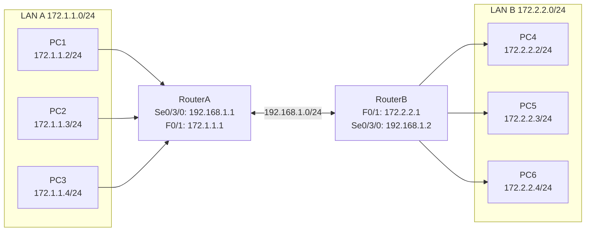

## 一、学习目标

学完本次实验后，你将能够：

1. 说明扩展ACL与标准ACL的区别
2. 配置扩展ACL基于源IP、目的IP、协议、端口过滤
3. 理解扩展ACL应靠近源放置
4. 使用`show access-lists`验证扩展ACL效果
5. （选做）配置复杂的多服务ACL规则

## 二、背景知识

### 核心概念

| 概念 | 含义 | 类比 |
|---|---|---|
| 扩展ACL | 基于源IP、目的IP、协议、端口过滤 | 智能安检 |
| 协议 | TCP、UDP、IP、ICMP等 | 交通工具类型 |
| 端口 | 服务标识，如Telnet=23、HTTP=80 | 车厢号 |
| eq | 等于某个端口 | 严格匹配 |
| any | 任意地址 | 任何人 |
| 靠近源 | 扩展ACL应在流量源头处应用 | 出发地安检 |

### 关键命令速查

```txt
! 创建扩展ACL
Router(config)# access-list 100 deny tcp 172.2.2.0 0.0.0.255 172.1.1.0 0.0.0.255 eq telnet
Router(config)# access-list 100 permit ip any any

! 应用到接口
Router(config)# interface fastethernet 0/1
Router(config-if)# ip access-group 100 in

! 查看ACL
Router# show access-lists
```

### 常用端口

| 服务 | 协议 | 端口 | ACL关键字 |
|---|---|---|---|
| Telnet | TCP | 23 | telnet |
| HTTP | TCP | 80 | www 或 80 |
| FTP | TCP | 21 | ftp |
| DNS | UDP/TCP | 53 | domain |
| SMTP | TCP | 25 | smtp |

## 三、实验拓扑



### 地址与接口规划

| 设备 | 接口 | IP地址 | 子网掩码 | 默认网关 |
|---|---|---|---|---|
| RouterA | Se0/3/0 | 192.168.1.1 | 255.255.255.0 | — |
| RouterA | F0/1 | 172.1.1.1 | 255.255.255.0 | — |
| RouterB | F0/1 | 172.2.2.1 | 255.255.255.0 | — |
| RouterB | Se0/3/0 | 192.168.1.2 | 255.255.255.0 | — |
| PC1 | — | 172.1.1.2 | 255.255.255.0 | 172.1.1.1 |
| PC2 | — | 172.1.1.3 | 255.255.255.0 | 172.1.1.1 |
| PC3 | — | 172.1.1.4 | 255.255.255.0 | 172.1.1.1 |
| PC4 | — | 172.2.2.2 | 255.255.255.0 | 172.2.2.1 |
| PC5 | — | 172.2.2.3 | 255.255.255.0 | 172.2.2.1 |
| PC6 | — | 172.2.2.4 | 255.255.255.0 | 172.2.2.1 |

## 四、实验任务

### 🔵 基础任务（必做，约45分钟）

**任务1：配置路由协议**

1. 搭建拓扑并配置所有接口IP。
2. 配置RIP或OSPF，使LAN A和LAN B的所有PC互通。
3. 验证Telnet服务：从PC6尝试Telnet到PC1（需先在PC1或LAN A某设备启用Telnet，或Telnet到路由器接口IP）。

记录：

| 测试 | 预期结果 | 实际结果 |
|---|---|---|
| PC6 ping PC1 | 通 | |
| PC6 telnet 172.1.1.1 | 通 | |

**任务2：配置扩展ACL**

在 RouterB 上：

```txt
configure terminal
access-list 100 deny tcp 172.2.2.0 0.0.0.255 172.1.1.0 0.0.0.255 eq telnet
access-list 100 permit ip any any
interface fastethernet 0/1
ip access-group 100 in
end
```

查看ACL：

```txt
show access-lists
```

记录输出：

```txt
Extended IP access list 100
    deny tcp 172.2.2.0 0.0.0.255 172.1.1.0 0.0.0.255 eq telnet (__ match(es))
    permit ip any any (__ match(es))
```

**任务3：验证过滤效果**

| 测试 | 预期结果 | 实际结果 | 原因 |
|---|---|---|---|
| PC6 telnet 172.1.1.1 | 不通 | | deny tcp eq telnet |
| PC6 ping 172.1.1.2 | 通 | | permit ip any any |
| PC5 telnet 172.1.1.1 | 不通 | | deny tcp eq telnet |
| PC5 ping 172.1.1.2 | 通 | | permit ip any any |
| PC6 ping PC5 | 通 | | 不涉及LAN A |

### 🟡 进阶任务（必做，约30分钟）

**任务4：只允许HTTP访问**

修改ACL，只允许LAN B访问LAN A的HTTP服务（TCP 80），禁止Telnet和其他服务。

```txt
RouterB(config)# no access-list 100
RouterB(config)# access-list 100 permit tcp 172.2.2.0 0.0.0.255 172.1.1.0 0.0.0.255 eq www
RouterB(config)# access-list 100 deny ip 172.2.2.0 0.0.0.255 172.1.1.0 0.0.0.255
RouterB(config)# access-list 100 permit ip any any
```

验证：

| 测试 | 预期结果 |
|---|---|
| PC6 ping 172.1.1.2 | 不通 |
| PC6 telnet 172.1.1.1 | 不通 |
| PC6 访问 172.1.1.2:80 | 通 |

> 注：Packet Tracer中可用Web Browser工具测试HTTP。

### 🔴 挑战任务（选做，约15分钟）

**任务5：复杂ACL规则**

配置ACL满足以下要求：

1. 允许LAN B访问LAN A的HTTP（TCP 80）和DNS（UDP 53）。
2. 禁止LAN B访问LAN A的Telnet（TCP 23）和FTP（TCP 21）。
3. 允许其他所有流量。

```txt
RouterB(config)# access-list 110 permit tcp 172.2.2.0 0.0.0.255 172.1.1.0 0.0.0.255 eq www
RouterB(config)# access-list 110 permit udp 172.2.2.0 0.0.0.255 172.1.1.0 0.0.0.255 eq domain
RouterB(config)# access-list 110 deny tcp 172.2.2.0 0.0.0.255 172.1.1.0 0.0.0.255 eq telnet
RouterB(config)# access-list 110 deny tcp 172.2.2.0 0.0.0.255 172.1.1.0 0.0.0.255 eq ftp
RouterB(config)# access-list 110 permit ip any any
```

思考：

- 这些规则的顺序是否可以调整？
- 如果`deny tcp ... eq telnet`放在`permit tcp ... eq www`之前会怎样？

## 五、思考题

1. 扩展ACL相比标准ACL有什么优势？
2. 为什么扩展ACL建议放在靠近源的地方？
3. 扩展ACL语法中`eq telnet`可以用什么代替？
4. 如果忘记写`permit ip any any`会出现什么后果？
5. 标准ACL和扩展ACL的编号范围分别是多少？
6. 如何测试Telnet是否被ACL阻止？
7. ACL规则匹配顺序有什么特点？

## 六、提交要求

请在实验报告中提交：

1. 完整拓扑截图。
2. 扩展ACL配置截图。
3. `show access-lists`截图（含匹配计数）。
4. PC6 telnet 失败和 ping 成功的对比截图。
5. 思考题回答。
6. Packet Tracer `.pkt`文件。
