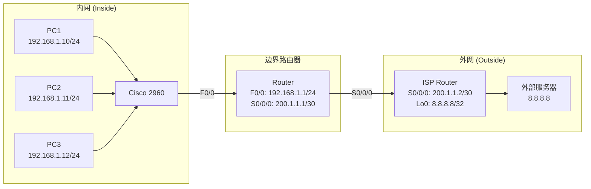

## 一、学习目标

学完本次实验后，你将能够：

1. 说明 NAT 三种工作方式的原理与区别。
2. 在路由器上配置静态 NAT、动态 NAT、NAPT。
3. 正确标记 inside/outside 接口。
4. 使用 `show ip nat translations` 验证 NAT 转换。
5. （选做）完成内部服务器端口映射。

## 二、背景知识

### 核心概念

| 概念 | 含义 | 类比 |
|---|---|---|
| NAT | 网络地址转换 | 公司前台 |
| 静态 NAT | 一对一固定映射 | VIP 专线 |
| 动态 NAT | 从地址池动态分配 | 共享工位 |
| NAPT/PAT | 端口地址复用 | 分机系统 |
| Inside Local | 内网主机真实 IP | 内部分机号 |
| Inside Global | 转换后的公网 IP | 对外总机号 |
| inside 接口 | 连接内网的接口 | 大门内侧 |
| outside 接口 | 连接外网的接口 | 大门外侧 |
| overload | 启用端口复用 | 分机系统开关 |

### 关键命令速查

```txt
! 标记接口角色
Router(config)# interface f0/0
Router(config-if)# ip nat inside
Router(config)# interface s0/0/0
Router(config-if)# ip nat outside

! 静态NAT
Router(config)# ip nat inside source static 192.168.1.10 200.1.1.10

! 动态NAT
Router(config)# ip nat pool MY_POOL 200.1.1.10 200.1.1.20 netmask 255.255.255.0
Router(config)# access-list 1 permit 192.168.1.0 0.0.0.255
Router(config)# ip nat inside source list 1 pool MY_POOL

! NAPT
Router(config)# access-list 1 permit 192.168.1.0 0.0.0.255
Router(config)# ip nat inside source list 1 interface s0/0/0 overload

! 验证
Router# show ip nat translations
```

## 三、实验拓扑



### 地址规划

| 设备 | 接口 | IP 地址 | 网关 |
|---|---|---|---|
| PC1 | — | `192.168.1.10/24` | `192.168.1.1` |
| PC2 | — | `192.168.1.11/24` | `192.168.1.1` |
| PC3 | — | `192.168.1.12/24` | `192.168.1.1` |
| Router | F0/0 | `192.168.1.1/24` | — |
| Router | S0/0/0 | `200.1.1.1/30` | — |
| ISP Router | S0/0/0 | `200.1.1.2/30` | — |
| ISP Router | Lo0 | `8.8.8.8/32` | — |

## 四、实验任务

### 🔵 基础任务（必做，约 45 分钟）

#### 任务 1：搭建拓扑并配置基本 IP

1. 添加 3 台 PC、1 台交换机、2 台路由器。
2. 按表格配置所有设备 IP 地址。
3. 在边界路由器上配置默认路由指向 ISP：

```txt
Router(config)# ip route 0.0.0.0 0.0.0.0 200.1.1.2
```

验证：

| 测试 | 预期结果 | 实际结果 |
|---|---|---|
| PC1 ping 192.168.1.1 | 通 | |
| Router ping 8.8.8.8 | 通 | |
| PC1 ping 8.8.8.8 | 不通 | （尚未配置 NAT） |

#### 任务 2：标记接口角色

在边界路由器上：

```txt
configure terminal
interface f0/0
 ip nat inside
 exit
interface s0/0/0
 ip nat outside
 exit
end
```

验证：

```txt
show ip nat statistics
```

#### 任务 3：配置 NAPT

```txt
configure terminal
access-list 1 permit 192.168.1.0 0.0.0.255
ip nat inside source list 1 interface s0/0/0 overload
end
```

验证三台 PC 都能 ping 通 `8.8.8.8`：

| 测试 | 预期结果 | 实际结果 |
|---|---|---|
| PC1 ping 8.8.8.8 | 通 | |
| PC2 ping 8.8.8.8 | 通 | |
| PC3 ping 8.8.8.8 | 通 | |

#### 任务 4：查看转换表

```txt
Router# show ip nat translations
```

记录：

| Protocol | Inside Global | Inside Local | Outside Local | Outside Global |
|---|---|---|---|---|
| icmp | `200.1.1.1:xxxx` | `192.168.1.10:xxxx` | `8.8.8.8:8` | `8.8.8.8:8` |
| icmp | `200.1.1.1:xxxx` | `192.168.1.11:xxxx` | `8.8.8.8:8` | `8.8.8.8:8` |
| icmp | `200.1.1.1:xxxx` | `192.168.1.12:xxxx` | `8.8.8.8:8` | `8.8.8.8:8` |

### 🟡 进阶任务（必做，约 30 分钟）

#### 任务 5：配置静态 NAT

删除 NAPT 配置，配置静态 NAT 使 PC1 固定映射到 `200.1.1.10`：

```txt
configure terminal
no ip nat inside source list 1 interface s0/0/0 overload
ip nat inside source static 192.168.1.10 200.1.1.10
end
```

验证：

| 测试 | 预期结果 |
|---|---|
| PC1 ping 8.8.8.8 | 通 |
| PC2 ping 8.8.8.8 | 不通 |

查看转换表，记录静态 NAT 条目：

```txt
Pro  Inside global      Inside local       Outside local      Outside global
---  200.1.1.10         192.168.1.10       ---                ---
```

#### 任务 6：配置动态 NAT

删除静态 NAT，配置动态 NAT：

```txt
configure terminal
no ip nat inside source static 192.168.1.10 200.1.1.10
ip nat pool MY_POOL 200.1.1.10 200.1.1.11 netmask 255.255.255.252
access-list 1 permit 192.168.1.0 0.0.0.255
ip nat inside source list 1 pool MY_POOL
end
```

验证：

| 测试 | 预期结果 | 原因 |
|---|---|---|
| PC1 ping 8.8.8.8 | 通 | 分配到地址池 IP |
| PC2 ping 8.8.8.8 | 通 | 分配到地址池 IP |
| PC3 ping 8.8.8.8 | 不通 | 地址池只有 2 个 IP |

### 🔴 挑战任务（选做，约 15 分钟）

#### 任务 7：内部 Web 服务器端口映射

假设内网有一台 Web 服务器（`192.168.1.100:80`），需要对外提供服务。配置静态 NAT 端口映射：

```txt
Router(config)# ip nat inside source static tcp 192.168.1.100 80 200.1.1.10 80
```

验证：从外网 PC 访问 `http://200.1.1.10` 能否访问到内网 Web 服务器。

思考：

- 为什么这里使用静态 NAT 而不是 NAPT？
- 外部用户访问的是哪个 IP？

## 五、思考题

1. NAT 的作用是什么？为什么要用 NAT 技术？
2. 静态 NAT、动态 NAT、NAPT 各适用于什么场景？
3. `ip nat inside` 和 `ip nat outside` 标反会出现什么现象？
4. NAPT 如何通过一个公网 IP 让多台内网主机同时上网？
5. NAT 和路由有什么区别？
6. NAT 有哪些局限性？
7. 如果要让外部用户访问内网服务器，应该使用哪种 NAT？

## 六、提交要求

请在实验报告中提交：

1. 完整拓扑截图。
2. NAPT 配置截图。
3. `show ip nat translations` 截图（三台 PC 同时 ping 时）。
4. 静态 NAT 和动态 NAT 配置截图。
5. 思考题回答。
6. Packet Tracer `.pkt` 文件。

### 提交格式

- 文件命名：`学号-HW12.zip`
- 截止时间：按课程公告要求
- 逾期提交将酌情扣分

> 提示：Packet Tracer 拓扑文件需包含完整配置与连通性验证结果，建议保存前先在各设备上执行一次验证命令。
