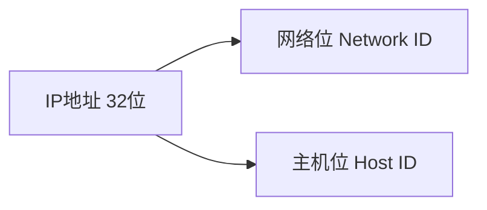
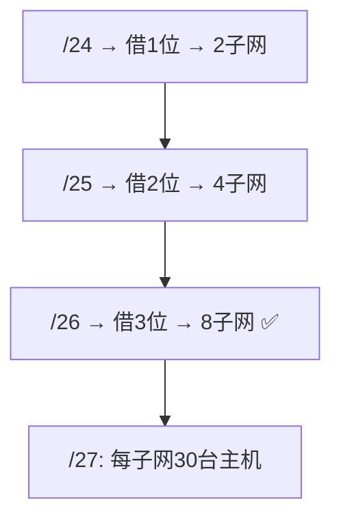
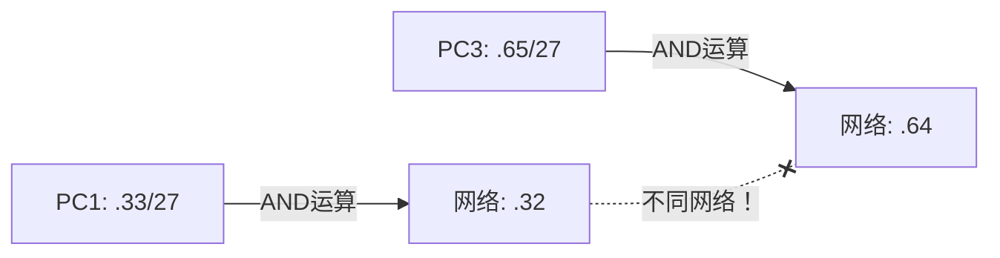
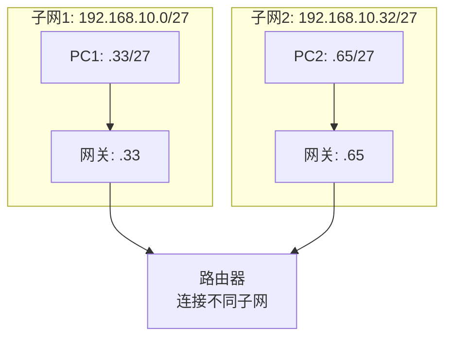
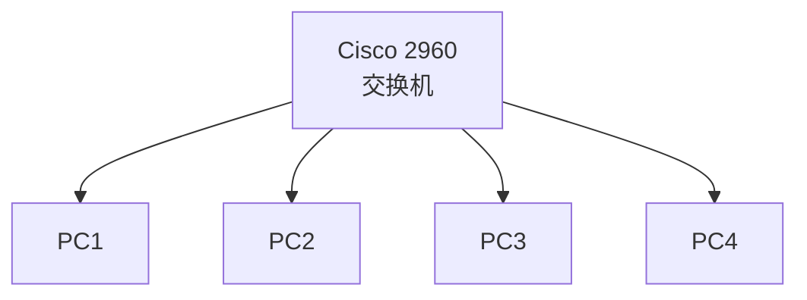

# 实验2 子网划分与IP地址分配

教学实践Ⅲ:计算机网络实验 · 第19周 第2课

---

# 学习目标

学完本节后，学生能够：

- 说明子网掩码的作用和计算原理
- 使用FLSM和VLSM方法进行子网划分
- 在Packet Tracer中配置IP地址并验证连通性
- 判断两个主机是否在同一子网

---

# 回顾：IP地址基础



| 类别 | 范围 | 默认掩码 | 网络位/主机位 |
|---|---|---|---|
| A | 1.0.0.0 ~ 126.255.255.255 | 255.0.0.0 (/8) | 8/24 |
| B | 128.0.0.0 ~ 191.255.255.255 | 255.255.0.0 (/16) | 16/16 |
| C | 192.0.0.0 ~ 223.255.255.255 | 255.255.255.0 (/24) | 24/8 |

**问题：** 一个C类网络 192.168.10.0/24 有254台主机，如果要把它们分成6个小网络，怎么办？

---

# 子网掩码：区分网络与主机的"尺子"

> Feynman类比：IP地址 = 门牌号（小区名 + 楼栋号 + 房间号），子网掩码告诉你哪部分是小区名

```
IP地址：    192.168.10.33
子网掩码：  255.255.255.224  (/27)
                    ↓
二进制：    11000000.10101000.00001010.001 00001
掩码：      11111111.11111111.11111111.111 00000
                                    ↑↑↑
                            借了3位做子网号
```

**AND运算 = IP地址 与 子网掩码 → 网络地址**

```
192.168.10.33 AND 255.255.255.224 = 192.168.10.32  ← 网络地址
```

---

# FLSM：等长划分（切披萨法）

> Feynman类比：切披萨 — 一刀2块、两刀4块、三刀8块

**从 192.168.10.0/24 划分6个子网：**



| 借位数 | 子网数 | 掩码 | 每子网主机数 | 够不够6个？ |
|:---:|:---:|:---:|:---:|:---:|
| 1 | 2 | /25 | 126 | ❌ |
| 2 | 4 | /26 | 62 | ❌ |
| **3** | **8** | **/27** | **30** | **✅ 够！** |

**公式：** 子网数 = 2ⁿ（n=借位数），主机数 = 2ʰ - 2（h=剩余主机位）

---

# 数轴法：画范围（公交车站）

> Feynman类比：首站=网络地址、末站=广播地址、中间站=可用主机

**192.168.10.0/27 的第一个子网：**

```
子网间隔 = 256 - 224 = 32

第1子网: 192.168.10.0  ~ 192.168.10.31
         ↑               ↑         ↑
       网络地址        可用主机    广播地址
       (不可用)      .1 ~ .30    (不可用)
```

**完整6个子网表：**

| 子网 | 网络地址 | 可用范围 | 广播地址 | 掩码 |
|:---:|---|---|---|:---:|
| 1 | 192.168.10.0 | .1 ~ .30 | 192.168.10.31 | /27 |
| 2 | 192.168.10.32 | .33 ~ .62 | 192.168.10.63 | /27 |
| 3 | 192.168.10.64 | .65 ~ .94 | 192.168.10.95 | /27 |
| 4 | 192.168.10.96 | .97 ~ .126 | 192.168.10.127 | /27 |
| 5 | 192.168.10.128 | .129 ~ .158 | 192.168.10.159 | /27 |
| 6 | 192.168.10.160 | .161 ~ .190 | 192.168.10.191 | /27 |

---

# 验证：同子网才互通

```
PC1: 192.168.10.33/27  ← 第2子网
PC2: 192.168.10.50/27  ← 第2子网 ✅ 互通！
PC3: 192.168.10.65/27  ← 第3子网 ❌ 不通！
```

**为什么 PC1 和 PC3 不通？**



> 结论：网络地址不同 = 不在同一子网 = 直接ping不通（需要路由器）

---

# VLSM：按需划分（公司分办公室）

> Feynman类比：公司分办公室 — 50人大部门给大房间，20人小部门给小房间

**场景：** 192.168.10.0/24，需要划分给三个部门：
- 部门A：50台主机 → 需要 ≥62个IP → **/26**（62台）
- 部门B：25台主机 → 需要 ≥30个IP → **/27**（30台）
- 部门C：20台主机 → 需要 ≥30个IP → **/27**（30台）

```
192.168.10.0/24
├── 部门A: 192.168.10.0/26    (.0 ~ .63)    62台 ✅
├── 部门B: 192.168.10.64/27   (.64 ~ .95)   30台 ✅
└── 部门C: 192.168.10.96/27   (.96 ~ .127)  30台 ✅
    剩余:  192.168.10.128/25  (.128 ~ .255) 留作扩展
```

**VLSM关键：** 从最大需求开始分配，每次从剩余空间中切

---

# 网关：跨子网的"关口"

> Feynman类比：不同楼栋之间串门，必须先出楼栋大门（网关）



**网关 = 路由器近端接口的IP地址**

- 网关必须和主机在**同一子网**
- 不同子网通信**必须经过网关**

---

# Packet Tracer 实验拓扑



**今日任务：**
1. 搭建拓扑（1交换机 + 4PC）
2. 按子网划分表配置各PC的IP地址和子网掩码
3. 验证：同子网ping通，跨子网ping不通
4. 思考：如何让跨子网也能通信？（下节课揭晓）

---

# PT 快速上手：添加设备

**第1步：添加交换机**
- 设备类型库 → `Switches` → 拖 `2960` 至工作区

**第2步：添加PC**
- 设备类型库 → `End Devices` → 拖 `PC-PT` 至工作区（×4）

**第3步：连接设备**
- 设备类型库 → `Connections` → 选 `Copper Straight-Through`（直通线）
- 先点PC → 选 `FastEthernet` → 再点交换机 → 选空闲 `FastEthernet` 接口

> **提示：** 鼠标悬停设备可查看端口状态和MAC地址

---

# PT 快速上手：配置IP

**第1步：打开PC配置面板**
- 单击PC → `Desktop` 选项卡 → `IP Configuration`

**第2步：填写IP参数**
```text
IP Address:    192.168.10.33
Subnet Mask:   255.255.255.224
Default Gateway: 留空（本实验不需要）
```

**第3步：用ping验证**
- 单击PC → `Desktop` → `Command Prompt`
- 输入 `ping 192.168.10.50`

**配置检查清单：**
| 检查项 | 正确做法 |
|---|---|
| IP地址 | 在可用范围内，不是网络地址/广播地址 |
| 子网掩码 | 与划分表一致（/27 = 255.255.255.224） |
| 同一子网的两台PC | 网络地址相同 |
| 不同子网的两台PC | 预期ping不通 |

---

# 实验任务发布

- 🔵 **基础任务**（必做，35分钟）
  - FLSM计算：192.168.10.0/24 → /27，列出6个子网
  - Packet Tracer：配置4台PC的IP/掩码，验证同子网互通

- 🟡 **进阶任务**（选做，20分钟）
  - VLSM计算：50台+25台+20台三部门划分
  - 分析：不同子网的PC为什么ping不通？需要什么设备？

- 🔴 **挑战任务**（选做，15分钟）
  - 场景设计：为100台电脑分两地的单位划分子网
  - 思考：路由汇聚（超网）是怎么回事？

**提交：** 实验报告（按教材附录A格式）

---

# 思考点

1. 为何要划分子网？为何要进行网络汇聚？

> 引导方向：广播域控制 / 安全隔离 / 管理效率 / IP资源优化

2. 192.168.1.60/26 和 192.168.1.66/26 能不能互ping？为什么？

> 关键：分别计算网络地址，判断是否同子网

3. 子网掩码设大了或设小了会怎样？

> 设大了：跨子网误判为同子网，数据包在本子网循环
> 设小了：同子网误判为跨子网，所有流量都走网关

---

# 小结 + 预告

**本课要点：**
- 子网掩码 = 区分网络位和主机位的尺子
- FLSM：等长切分，2ⁿ个子网，每子网2ʰ-2台主机
- VLSM：按需分配，从大到小切
- 同子网互通，跨子网需要网关（路由器）

**下次课：Exp 3 交换机基本配置**

**预习：** 交换机常用命令、配置模式

## Summary

本实验围绕子网掩码、FLSM、VLSM 与 Packet Tracer IP 配置展开，重点训练学生根据网络地址和掩码判断主机是否属于同一子网，并通过 ping 验证同子网互通、跨子网不直通的现象。
