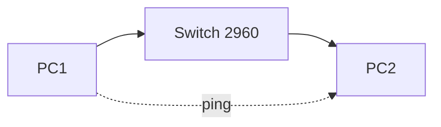
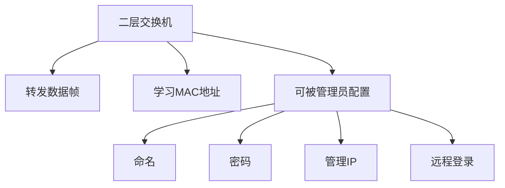
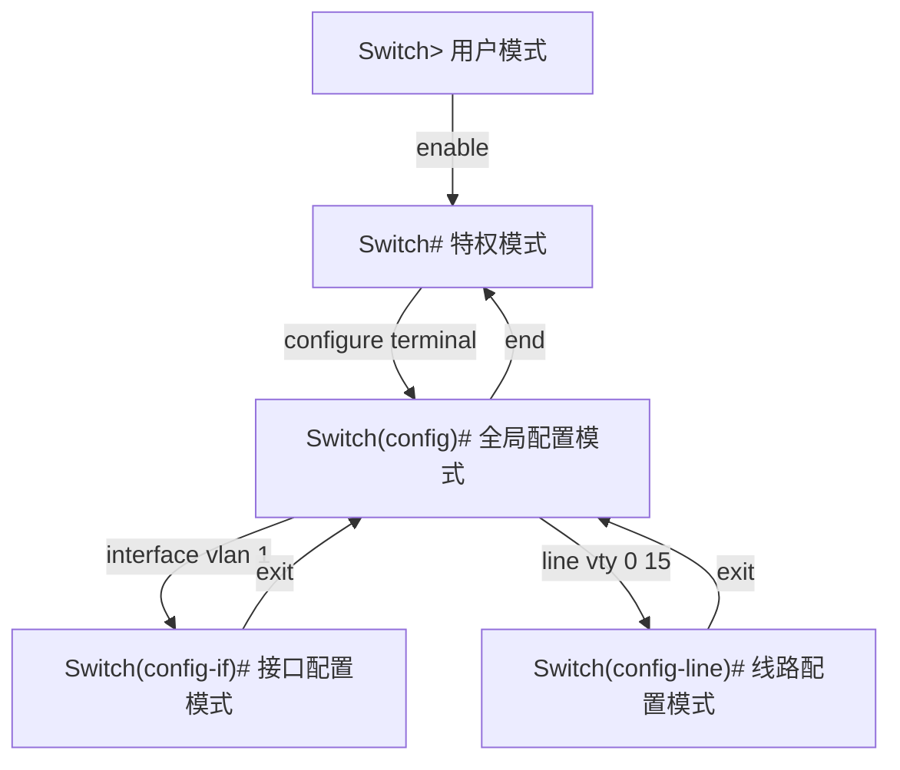
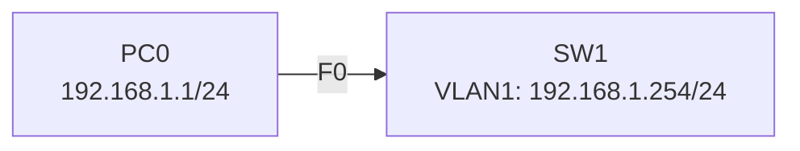
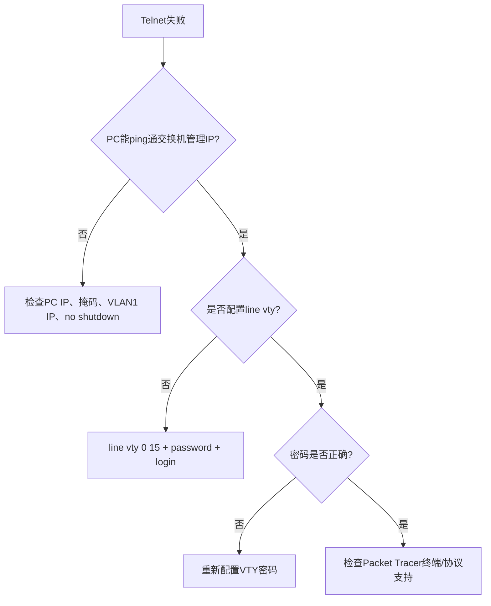

# 实验3 交换机基本配置

教学实践Ⅲ:计算机网络实验 · 第19周 第3课

---

# 学习目标

学完本节后，学生能够：

- 说明交换机五种配置模式及功能
- 完成交换机名称、密码、管理IP配置
- 配置VTY线路，实现Telnet远程登录
- 使用show命令查看配置，并保存配置
- 根据Telnet失败现象定位常见配置错误

---

# 从“能通信”到“能管理”

上节课我们解决了：



本节课要解决：

> 交换机本身如何命名、设置密码、配置管理IP，并允许管理员远程登录？

---

# 交换机是什么？



> Feynman类比：交换机像一栋办公楼，不仅要会“转发快递”，还要有门牌、管理员钥匙和联系电话。

---

# IOS模式：进入不同“楼层”



**口诀：看提示符，再输命令。**

---

# 命令辅助：不会就问“？”

```txt {*|1|3|5|7}
Switch# ?
显示当前模式下所有可用命令

Switch# show ?
显示show后面可接的参数

Switch# conf<Tab>
自动补全为 configure
```

常用技巧：

- `?`：查看帮助
- Tab：自动补全
- 命令可缩写：`configure terminal` → `conf t`
- 删除配置：在原命令前加 `no`

---

# 修改交换机名称

```txt {*|1|2|3|4}
Switch> enable
Switch# configure terminal
Switch(config)# hostname SW1
SW1(config)#
```

观察提示符变化：

| 配置前 | 配置后 |
|---|---|
| `Switch(config)#` | `SW1(config)#` |

> 主机名就像设备“姓名牌”，后续排错时能快速识别是哪台设备。

---

# 设置特权模式密码

```txt {*|1|2|3}
SW1(config)# enable password cisco
SW1(config)# enable secret class
SW1(config)# end
```

| 命令 | 特点 | 建议 |
|---|---|---|
| `enable password` | 明文保存 | 教材演示可见 |
| `enable secret` | 加密保存，优先级更高 | 实际更推荐 |

> Feynman类比：`enable secret`像加密钥匙盒，安全性高于普通口令纸条。

---

# 管理IP：配置在VLAN 1

二层交换机的物理端口主要负责转发，管理IP通常配置在VLAN接口上：

```txt {*|1|2|3|4}
SW1(config)# interface vlan 1
SW1(config-if)# ip address 192.168.1.254 255.255.255.0
SW1(config-if)# no shutdown
SW1(config-if)# exit
```

> Feynman类比：管理IP是交换机“办公室门牌号”，管理员通过这个地址找到交换机。

---

# 拓扑与地址规划



PC配置：

| 设备 | IP地址 | 掩码 | 默认网关 |
|---|---|---|---|
| PC0 | 192.168.1.1 | 255.255.255.0 | 可空 |
| SW1 VLAN1 | 192.168.1.254 | 255.255.255.0 | 可空 |

验证：

```txt
PC> ping 192.168.1.254
```

---

# 配置Telnet远程登录

```txt {*|1|2|3|4}
SW1(config)# line vty 0 15
SW1(config-line)# password cisco
SW1(config-line)# login
SW1(config-line)# end
```

PC端登录：

```txt
PC> telnet 192.168.1.254
Password: cisco
SW1>
```

> Telnet = 打电话进交换机办公室；`password`是口令，`login`是“允许接入”。

---

# 查看配置

```txt {*|1|3|5}
SW1# show running-config
查看当前正在运行的配置

SW1# show startup-config
查看启动时加载的配置

SW1# show ip interface brief
查看接口IP与状态
```

| 配置 | 含义 |
|---|---|
| running-config | 当前临时配置，断电/重启可能丢失 |
| startup-config | 启动配置，重启后仍保留 |

---

# 保存配置

```txt {*|1|2|3}
SW1# copy running-config startup-config
Destination filename [startup-config]? 
Building configuration...
```

也可在部分设备中使用：

```txt
SW1# write
```

> Feynman类比：running-config是临时便签，startup-config是正式档案。只写便签，不归档，重启后就找不到了。

---

# Telnet失败排查流程



---

# 学生实验任务

🔵 基础任务：

- 完成IOS模式切换记录
- 配置`hostname SW1`
- 配置特权密码
- 使用`show running-config`查看配置

🟡 进阶任务：

- 配置VLAN1管理IP
- 配置VTY线路
- 从PC Telnet登录交换机
- 保存配置

🔴 挑战任务：

- 制造一个Telnet失败故障并修复

---

# 常见错误

| 错误 | 现象 | 修复 |
|---|---|---|
| 模式错误 | `% Invalid input` | 看提示符，进入正确模式 |
| 忘记`no shutdown` | ping不通管理IP | 进入`int vlan 1`执行`no shut` |
| PC不同网段 | ping不通 | 修改PC或VLAN1 IP |
| 忘记`login` | Telnet异常 | 在线路模式加`login` |
| 未保存配置 | 重启后丢失 | `copy run start` |

---

# 小结

本节课掌握了交换机“可管理”的基础：


下节课：**VLAN实验**  
我们将把一台交换机逻辑切分成多个“虚拟局域网”。

## Summary

本实验围绕交换机基本配置展开，重点训练学生在 Cisco IOS 不同配置模式下完成设备命名、密码、VLAN1 管理 IP、VTY/Telnet 远程登录、show 查看与配置保存，并能根据 ping 与 Telnet 现象定位常见配置错误。
