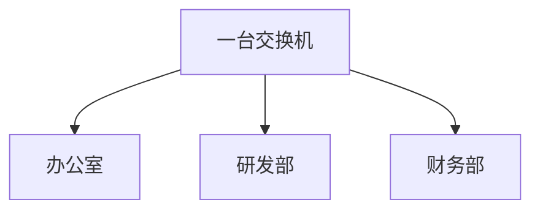
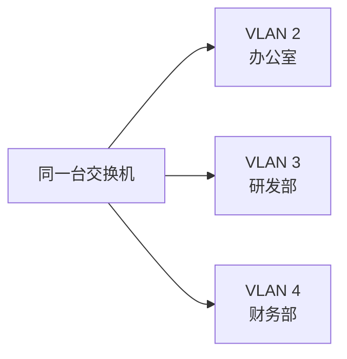
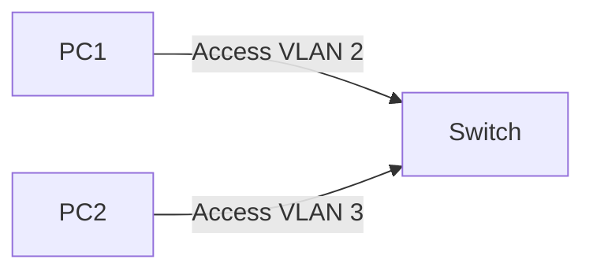
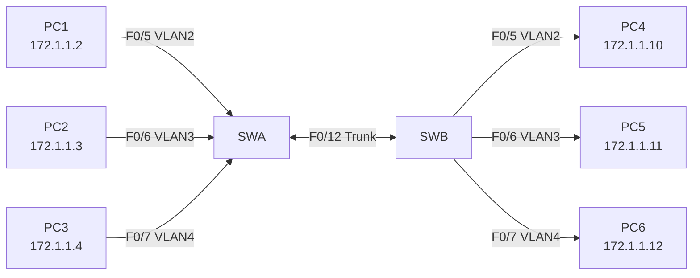
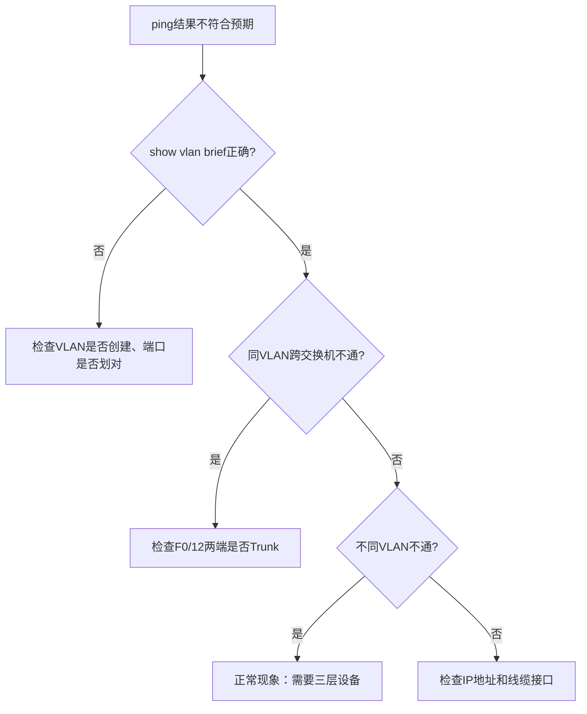

# 实验4 VLAN实验

教学实践Ⅲ:计算机网络实验 · 第19周 第4课

---

# 学习目标

学完本节后，学生能够：

- 说明VLAN的作用和广播域隔离意义
- 创建VLAN 2、VLAN 3、VLAN 4
- 将交换机端口静态划入指定VLAN
- 配置Trunk链路，实现同VLAN跨交换机通信
- 使用`show vlan brief`和ping结果分析连通性

---

# 导入：同一交换机也需要隔离吗？

场景：一个实验室里有三个部门。



如果所有PC都在默认VLAN 1：

- 广播消息所有人都能收到
- 部门之间缺少隔离
- 管理和安全边界不清晰

**问题：能否不增加交换机，也把它们逻辑隔开？**

---

# VLAN：虚拟局域网

> Feynman类比：VLAN像办公楼门禁系统，同一栋楼可以分成多个门禁区域。



VLAN的作用：

- 划分广播域
- 隔离不同部门流量
- 提升安全性与可管理性

---

# VLAN 与 IP 子网

| 项目 | VLAN | IP子网 |
|---|---|---|
| 所在层次 | 二层（数据链路层） | 三层（网络层） |
| 作用 | 划分广播域 | 划分IP地址范围 |
| 设备配置 | 交换机端口 | 主机/三层接口IP |
| 常见关系 | 一个VLAN常对应一个子网 | 一个子网常对应一个VLAN |

> 注意：VLAN和IP子网不是同一个概念，但工程中常配合使用。

---

# Access端口：普通员工门

Access端口通常连接PC，只属于一个VLAN。

```txt {*|1|2|3}
SWA(config)# interface f0/5
SWA(config-if)# switchport mode access
SWA(config-if)# switchport access vlan 2
```



> Access = 普通员工门，一扇门只通向一个部门。

---

# Trunk端口：物流电梯

Trunk端口通常连接交换机，可以承载多个VLAN。

```txt {*|1|2}
SWA(config)# interface f0/12
SWA(config-if)# switchport mode trunk
```


> Trunk = 物流电梯，一根通道运送多个部门的包裹，但包裹需要贴VLAN标签。

---

# 实验拓扑



---

# 地址与端口规划

| 主机 | 所接交换机 | 接口 | VLAN | IP地址 |
|---|---|---|:---:|---|
| PC1 | SWA | F0/5 | 2 | 172.1.1.2/24 |
| PC2 | SWA | F0/6 | 3 | 172.1.1.3/24 |
| PC3 | SWA | F0/7 | 4 | 172.1.1.4/24 |
| PC4 | SWB | F0/5 | 2 | 172.1.1.10/24 |
| PC5 | SWB | F0/6 | 3 | 172.1.1.11/24 |
| PC6 | SWB | F0/7 | 4 | 172.1.1.12/24 |

---

# 创建VLAN：SWA示例

```txt {*|1|2|3|4|5|6|7|8|9|10}
SWA# configure terminal
SWA(config)# vlan 2
SWA(config-vlan)# name vlan2
SWA(config-vlan)# exit
SWA(config)# vlan 3
SWA(config-vlan)# name vlan3
SWA(config-vlan)# exit
SWA(config)# vlan 4
SWA(config-vlan)# name vlan4
SWA(config-vlan)# exit
```

SWB也要创建同样的VLAN。

---

# 划分Access端口

SWA配置：

```txt {*|1-3|4-6|7-9}
SWA(config)# interface f0/5
SWA(config-if)# switchport mode access
SWA(config-if)# switchport access vlan 2
SWA(config)# interface f0/6
SWA(config-if)# switchport mode access
SWA(config-if)# switchport access vlan 3
SWA(config)# interface f0/7
SWA(config-if)# switchport mode access
SWA(config-if)# switchport access vlan 4
```

SWB的F0/5、F0/6、F0/7同样分别划入VLAN 2、3、4。

---

# 查看VLAN配置

```txt
SWA# show vlan brief
```

预期关键输出：

```txt
VLAN Name   Status   Ports
1    default active   Fa0/1, Fa0/2, Fa0/3, Fa0/4...
2    vlan2   active   Fa0/5
3    vlan3   active   Fa0/6
4    vlan4   active   Fa0/7
```

检查重点：

- VLAN是否存在
- 端口是否进入正确VLAN
- 接口号是否与实际连线一致

---

# 配置Trunk

SWA：

```txt {*|1|2|3}
SWA(config)# interface f0/12
SWA(config-if)# switchport mode trunk
SWA(config-if)# exit
```

SWB：

```txt {*|1|2|3}
SWB(config)# interface f0/12
SWB(config-if)# switchport mode trunk
SWB(config-if)# exit
```

验证Trunk：

```txt
SWA# show interfaces trunk
```

---

# 连通性验证矩阵

| 测试 | 预期结果 | 原因 |
|---|---|---|
| PC1 → PC4 | ✅ 通 | 同属VLAN 2，Trunk承载VLAN 2 |
| PC2 → PC5 | ✅ 通 | 同属VLAN 3，Trunk承载VLAN 3 |
| PC3 → PC6 | ✅ 通 | 同属VLAN 4，Trunk承载VLAN 4 |
| PC1 → PC2 | ❌ 不通 | 不同VLAN |
| PC4 → PC5 | ❌ 不通 | 不同VLAN |
| PC1 → PC5 | ❌ 不通 | 不同VLAN |

不同VLAN互通需要三层设备，下节课解决。

---

# 常见错误排查



---

# 学生实验任务

🔵 基础任务：

- 创建VLAN 2、3、4
- 将F0/5、F0/6、F0/7划入对应VLAN
- 使用`show vlan brief`验证

🟡 进阶任务：

- 两台交换机均完成VLAN划分
- F0/12配置Trunk
- 完成连通性矩阵测试

🔴 挑战任务：

- 删除VLAN后观察端口和连通性变化
- 比较三条Access链路与一条Trunk链路

---

# 小结


今天的结论：

- 同一交换机不代表一定互通
- 同一IP网段也可能因VLAN隔离而不通
- 不同VLAN之间要互通，需要三层交换或路由

---

# 下节课预告

## 实验5 三层交换机配置

问题：

> VLAN隔离后，办公室和研发部如果需要受控互访，应该怎么办？

答案：使用三层交换机实现VLAN间通信。

## Summary

本实验围绕 VLAN 划分与 Trunk 链路配置展开，重点训练学生在 Cisco Packet Tracer 中创建 VLAN、划分 Access 端口、配置交换机间 Trunk，并通过 `show vlan brief`、`show interfaces trunk` 与 ping 矩阵验证同 VLAN 跨交换机通信和不同 VLAN 隔离效果。
