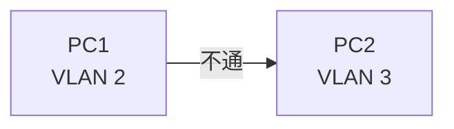
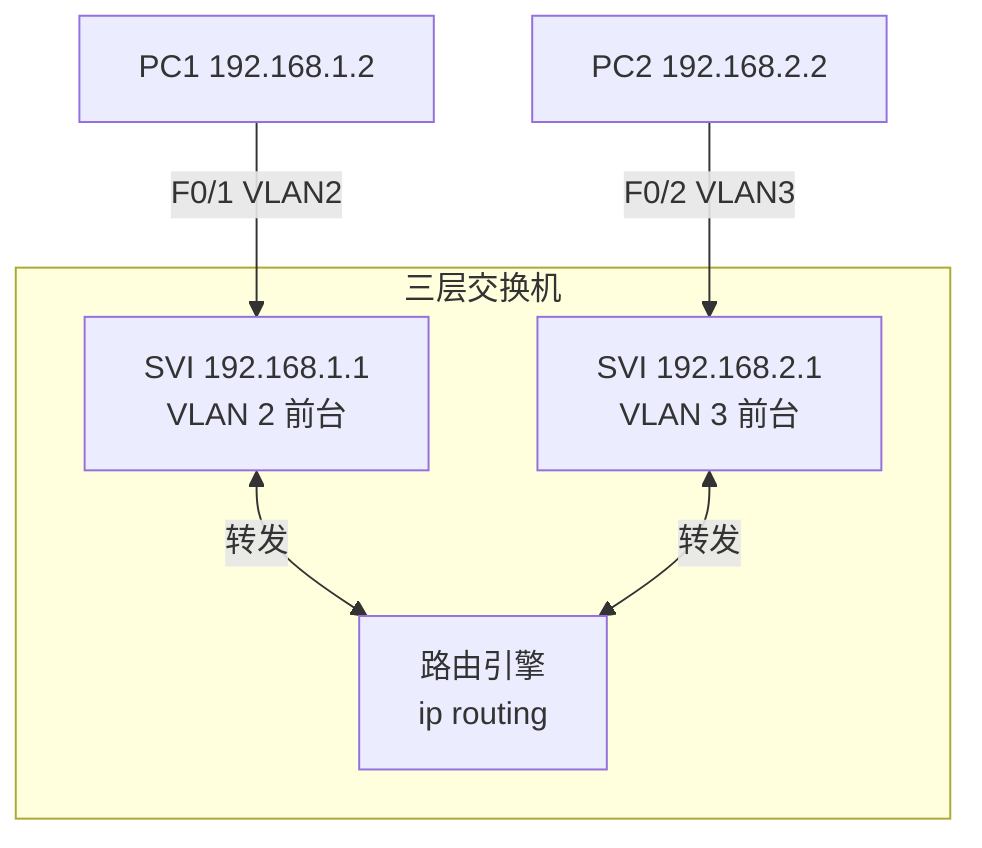
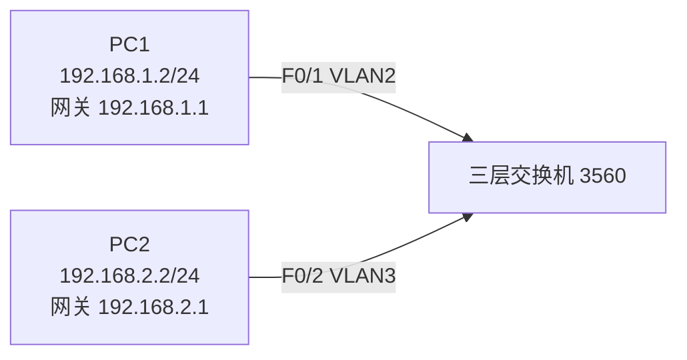
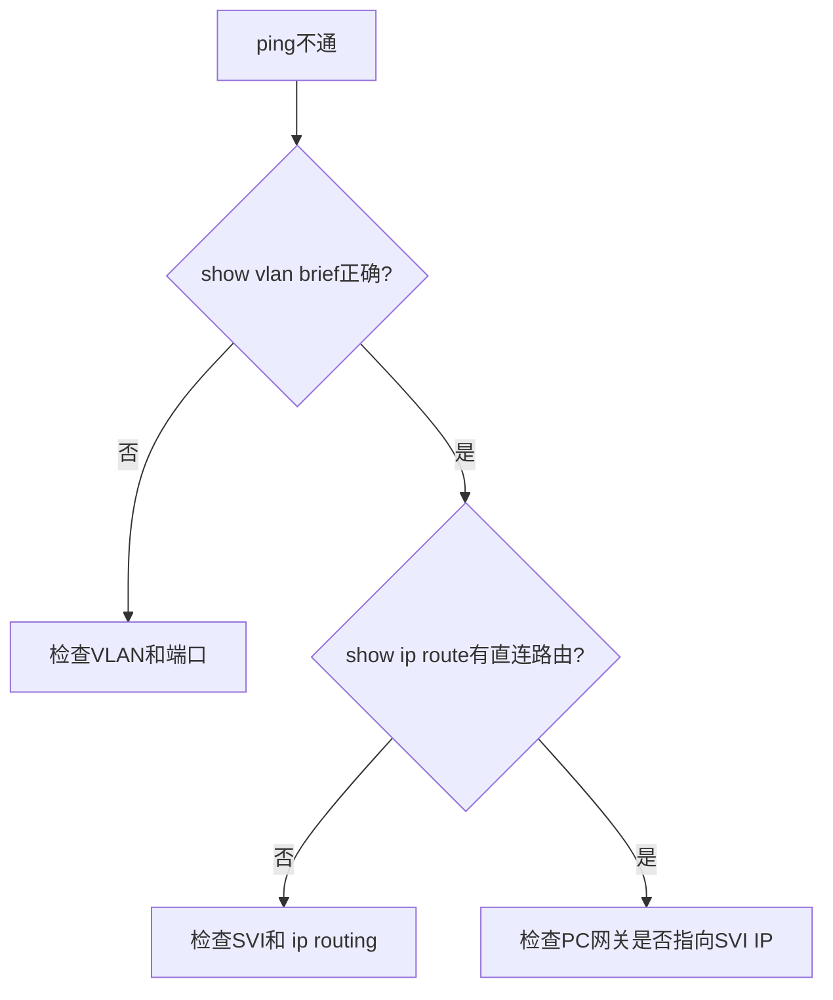
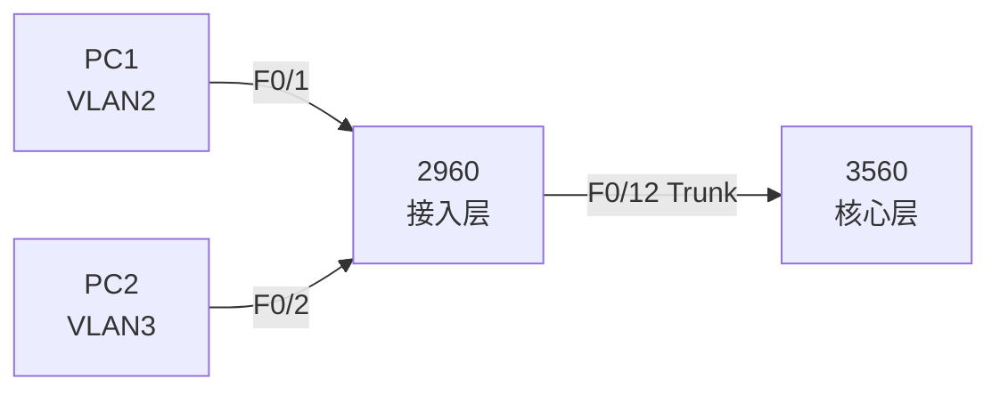
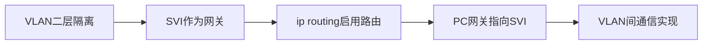

教学实践Ⅲ:计算机网络实验 · 第19周 第5课

## 学习目标

学完本节后，学生能够：

- 说明三层交换机的作用，区分二层/三层交换机与路由器
- 通过SVI方式实现不同VLAN之间的路由
- 正确配置PC的IP地址和默认网关
- 使用`show ip route`和`show vlan brief`排查VLAN间路由问题

## 回顾：VLAN隔离后怎么办？

场景：办公室（VLAN 2）和研发部（VLAN 3）需要互访。



问题：

> 划分VLAN后，同一交换机上的不同VLAN默认不能二层通信。如果需要受控互访，怎么办？

答案：引入三层设备实现VLAN间路由。

## 三层交换机：带前台的门禁大楼

> Feynman类比：三层交换机像一栋带前台的门禁大楼。不同楼层/部门（VLAN）的人要互访，必须到前台（SVI/网关）登记转接。



三层交换机 = 二层交换机 + 内置路由引擎

## 二层 vs 三层 vs 路由器

| 设备 | 工作层次 | 主要功能 | 特点 |
|---|---|---|---|
| 二层交换机 | 数据链路层 | 同网段转发、VLAN隔离 | 速度快、接口多、无路由 |
| 三层交换机 | 数据链路层+网络层 | VLAN间路由、同网段转发 | 接口多、转发快、适合园区网 |
| 路由器 | 网络层 | 跨网络路由、NAT、ACL、拨号 | 功能全、接口少、适合边界 |

> 园区网内部常用三层交换机做VLAN间路由；边界用路由器连接Internet。

## 实现VLAN间路由的两种方式

### 方式A：SVI（交换机虚拟接口）

为每个VLAN创建一个虚拟三层接口作为网关。

```txt
interface vlan 2
 ip address 192.168.1.1 255.255.255.0
interface vlan 3
 ip address 192.168.2.1 255.255.255.0
ip routing
```

### 方式B：`no switchport`

关闭物理端口的二层功能，直接配IP。

```txt
interface f0/1
 no switchport
 ip address 192.168.1.1 255.255.255.0
```

> 本课重点学习SVI方式，实际工程中更常用。

## 实验拓扑



### 地址规划

| 主机 | 接口 | VLAN | IP地址 | 默认网关 |
|---|---|:---:|---|---|
| PC1 | F0/1 | 2 | 192.168.1.2/24 | 192.168.1.1 |
| PC2 | F0/2 | 3 | 192.168.2.2/24 | 192.168.2.1 |

## 步骤1：创建VLAN并划分Access端口

```txt
Switch# configure terminal
Switch(config)# vlan 2
Switch(config-vlan)# name vlan2
Switch(config-vlan)# exit
Switch(config)# vlan 3
Switch(config-vlan)# name vlan3
Switch(config-vlan)# exit
Switch(config)# interface f0/1
Switch(config-if)# switchport mode access
Switch(config-if)# switchport access vlan 2
Switch(config-if)# interface f0/2
Switch(config-if)# switchport access vlan 3
```

验证：

```txt
Switch# show vlan brief
```

## 步骤2：配置SVI接口

```txt
Switch(config)# interface vlan 2
Switch(config-if)# ip address 192.168.1.1 255.255.255.0
Switch(config-if)# exit
Switch(config)# interface vlan 3
Switch(config-if)# ip address 192.168.2.1 255.255.255.0
Switch(config-if)# exit
Switch(config)# ip routing
Switch(config)# end
```

关键点：

- `interface vlan X` 是VLAN X的虚拟三层接口
- SVI IP就是该VLAN内PC的默认网关
- `ip routing` 必须开启，否则路由不生效

## 步骤3：配置PC并验证

PC1配置：

```txt
IP地址：192.168.1.2
子网掩码：255.255.255.0
默认网关：192.168.1.1
```

PC2配置：

```txt
IP地址：192.168.2.2
子网掩码：255.255.255.0
默认网关：192.168.2.1
```

验证：

```txt
PC> ping 192.168.2.2
```

## 查看路由表

```txt
Switch# show ip route
```

预期关键输出：

```txt
C    192.168.1.0/24 is directly connected, Vlan2
C    192.168.2.0/24 is directly connected, Vlan3
```

`C` 表示Connected（直连路由），说明三层交换机已经知道这两个网段。

## 关键命令流程图


## 常见错误排查



## 对比：SVI vs no switchport

| 特性 | SVI方式 | `no switchport`方式 |
|---|---|---|
| 是否需要创建VLAN | 是 | 否 |
| 是否使用物理端口IP | 否 | 是 |
| 一个端口能否承载多个VLAN | 是 | 否 |
| 适用场景 | VLAN间路由 | 点到点三层连接 |
| 工程使用频率 | 高 | 低 |

## 拔高：三层+二层联合拓扑



核心思想：

- 2960负责接入和VLAN划分
- 3560负责VLAN间路由
- Trunk承载多个VLAN流量
- VTP同步VLAN信息（可选）

## 学生实验任务

🔵 基础任务：

- 创建VLAN 2/3
- F0/1、F0/2分别划入VLAN 2/3
- 配置SVI IP并开启`ip routing`
- 验证PC1与PC2跨VLAN通信

🟡 进阶任务：

- 关闭/开启`ip routing`观察变化
- 对比SVI与`no switchport`两种方式

🔴 挑战任务：

- 完成3560+2960联合拓扑

## 小结



今日要点：

- VLAN在二层隔离广播域
- 三层交换机通过SVI实现VLAN间路由
- `ip routing`是总开关
- PC的网关必须指向对应VLAN的SVI IP

## 下节课预告

### 实验6 路由器的基本配置

问题：

> 三层交换机适合园区网内部，如果要连接Internet或不同园区网，需要什么设备？

答案：路由器。

预习：路由器基本命令、接口类型、Console/Telnet配置。
