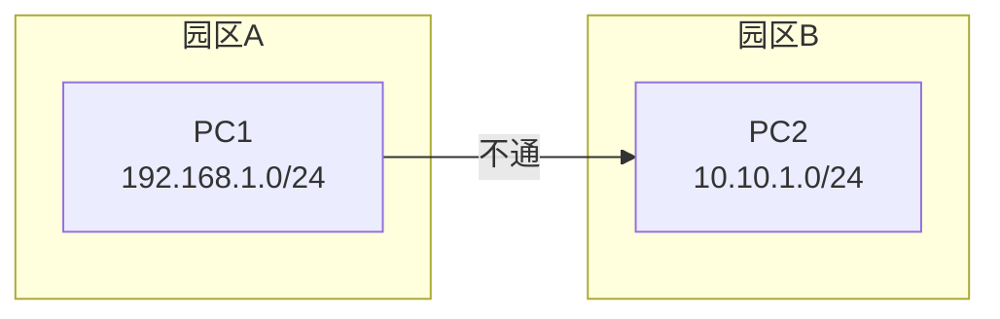
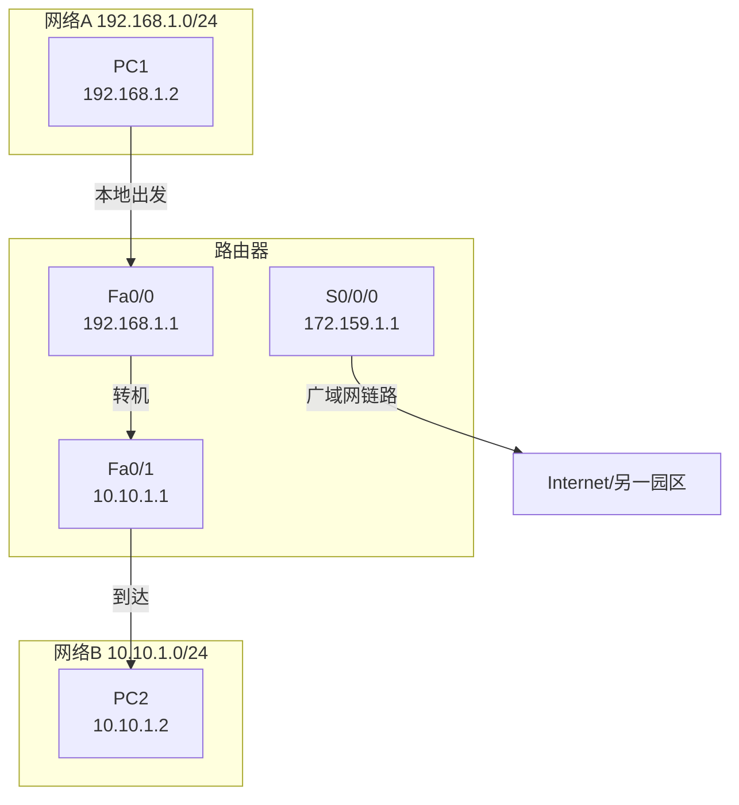
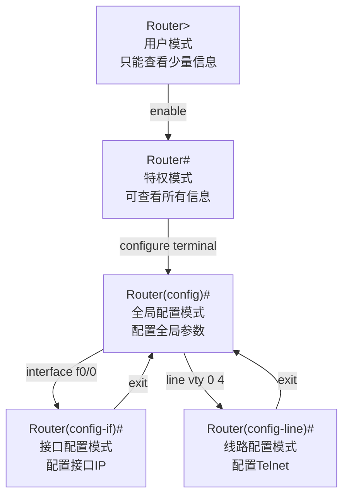
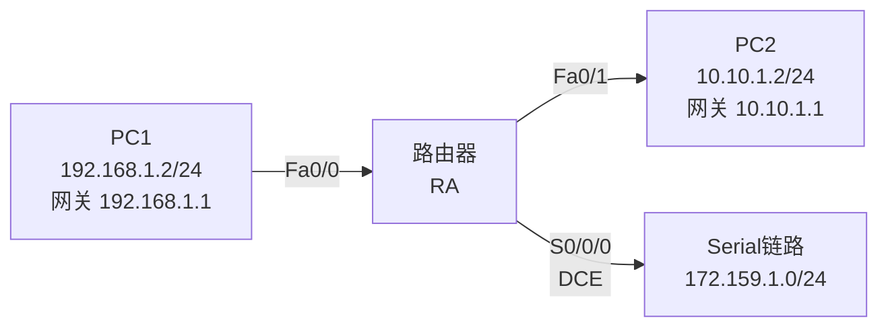
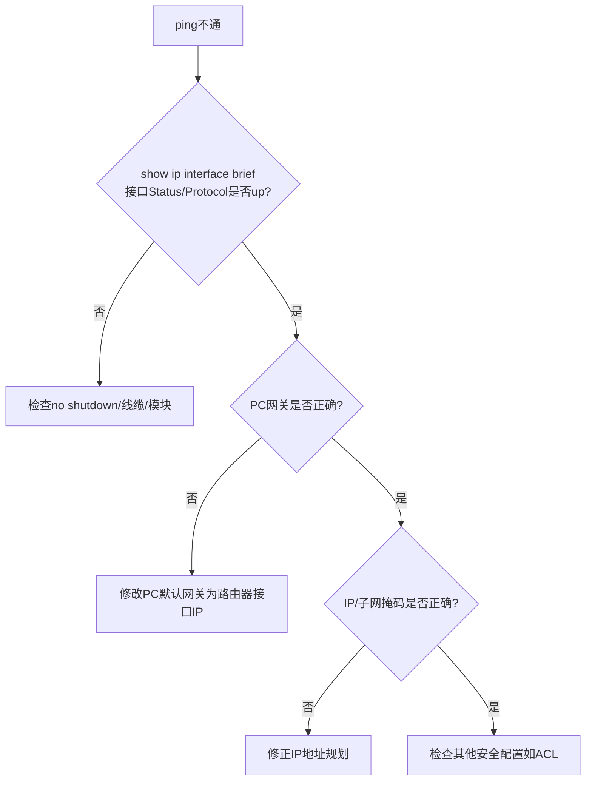

## 学习目标

学完本节后，学生能够：

- 说明路由器的作用，区分路由器与二层/三层交换机
- 在Cisco路由器上配置主机名、Ethernet/Serial接口IP并激活接口
- 配置PC的IP地址和默认网关，验证跨网段连通性
- 配置Telnet远程登录和`enable secret`特权密码
- 使用`show ip interface brief`等命令排查接口状态

## 回顾：三层交换机之后学什么？

场景：园区网内部VLAN之间已经能互通。现在要把两个园区网连起来，或接入Internet。



问题：

> 三层交换机适合同一园区网内部的VLAN间路由。如果两个不同园区网（不同网段）要互联，需要什么设备？

答案：路由器。

## 路由器：网络之间的机场

> Feynman类比：路由器像连接不同城市的机场。每个城市是一个独立的网络，数据包要去别的城市，必须先到本地机场（路由器接口），再转机到目的地。



路由器 = 工作在网络层，根据IP地址转发数据包。

## 交换机 vs 路由器

| 设备 | 工作层次 | 主要功能 | 接口特点 |
|---|---|---|---|
| 二层交换机 | 数据链路层 | 同网段转发、VLAN隔离 | 接口多，无IP |
| 三层交换机 | 数据链路层+网络层 | VLAN间路由、高速转发 | 接口多，SVI做网关 |
| 路由器 | 网络层 | 连接不同网络、路由选择、NAT、ACL、拨号 | 接口类型多（以太网/串口等） |

> 园区网内部用三层交换机，网络边界/互联用路由器。

## 路由器CLI配置模式



口诀：**用户→特权→全局→接口/线路**。

## 实验拓扑



### 地址规划

| 设备 | 接口 | 网络 | IP地址 | 默认网关 |
|---|---|---|---|---|
| RA | Fa0/0 | 192.168.1.0/24 | 192.168.1.1/24 | — |
| RA | Fa0/1 | 10.10.1.0/24 | 10.10.1.1/24 | — |
| RA | S0/0/0 | 172.159.1.0/24 | 172.159.1.1/24 | — |
| PC1 | — | 192.168.1.0/24 | 192.168.1.2/24 | 192.168.1.1 |
| PC2 | — | 10.10.1.0/24 | 10.10.1.2/24 | 10.10.1.1 |

## 步骤1：主机名与Ethernet接口

```txt
Router> enable
Router# configure terminal
Router(config)# hostname RA
RA(config)# interface fastethernet 0/0
RA(config-if)# ip address 192.168.1.1 255.255.255.0
RA(config-if)# no shutdown
RA(config-if)# exit
RA(config)# interface fastethernet 0/1
RA(config-if)# ip address 10.10.1.1 255.255.255.0
RA(config-if)# no shutdown
RA(config-if)# end
```

关键点：

- 每个接口必须属于不同网络（不能在同一子网）
- `no shutdown` 是激活接口的必须命令
- 先`ip address`，再`no shutdown`

## 步骤2：Serial接口与clock rate

Packet Tracer中若路由器无Serial接口，需先关闭电源，添加WIC-1T等串口模块。

```txt
RA(config)# interface serial 0/0/0
RA(config-if)# ip address 172.159.1.1 255.255.255.0
RA(config-if)# clock rate 64000
RA(config-if)# no shutdown
RA(config-if)# end
```

关键点：

- `clock rate`只在DCE端配置，DTE端不需要
- 在Packet Tracer中，连接线缆时会显示哪一端是DCE
- 串口常用于广域网连接

## 步骤3：PC配置与验证

PC1配置：

```txt
IP地址：192.168.1.2
子网掩码：255.255.255.0
默认网关：192.168.1.1
```

PC2配置：

```txt
IP地址：10.10.1.2
子网掩码：255.255.255.0
默认网关：10.10.1.1
```

验证：

```txt
PC> ping 10.10.1.2   ! 从PC1 ping PC2
PC> ping 192.168.1.2  ! 从PC2 ping PC1
```

## 查看接口状态

```txt
RA# show ip interface brief
```

预期关键输出：

```txt
Interface              IP-Address      OK? Method Status                Protocol
FastEthernet0/0        192.168.1.1     YES manual up                    up
FastEthernet0/1        10.10.1.1       YES manual up                    up
Serial0/0/0            172.159.1.1     YES manual up                    up
```

`Status`和`Protocol`都为`up`表示接口已激活。

## 常见错误排查



## 步骤4：Telnet远程登录配置

配置远程登录，允许从PC通过网络管理路由器：

```txt
RA(config)# line vty 0 4
RA(config-line)# login
RA(config-line)# password star
RA(config-line)# exit
```

验证：在PC的命令行中执行

```txt
PC> telnet 192.168.1.1
Trying 192.168.1.1 ...Open
User Access Verification
Password: star
RA>
```

> `line vty 0 4` 表示允许5个并发Telnet会话。

## 步骤5：特权模式密码

```txt
RA(config)# enable secret abc
RA(config)# enable password star
```

区别：

- `enable secret`：加密存储，安全性高，**推荐**
- `enable password`：明文存储，安全性低

验证Telnet后能否进入特权模式：

```txt
RA> enable
Password: abc
RA#
```

## 保存配置

运行配置掉电丢失，必须保存到启动配置：

```txt
RA# write memory
! 或
RA# copy running-config startup-config
```

验证：

```txt
RA# show startup-config
```

## 关键命令流程图


## 学生实验任务

🔵 基础任务：

- 配置路由器主机名
- 配置Fa0/0、Fa0/1的IP地址并`no shutdown`
- 配置PC1、PC2的IP和网关
- 验证PC1与PC2跨网段通信

🟡 进阶任务：

- 配置Serial接口（含`clock rate`）
- 配置Telnet远程登录和`enable secret`
- 从PC远程登录路由器并进入特权模式

🔴 挑战任务：

- 两台路由器通过Serial链路互联
- 验证Serial接口互通和跨路由器Telnet

## 小结


今日要点：

- 路由器工作在网络层，连接不同网络
- 每个接口必须配置不同网段的IP地址
- `no shutdown`是接口激活的关键
- Serial链路中DCE端需要配置`clock rate`
- 远程管理需要`line vty`密码，特权模式推荐`enable secret`

## 下节课预告

### 实验7 静态路由

问题：

> 两台路由器互联后，各自背后的LAN能否直接互通？

答案：不能自动互通，需要配置路由。

预习：静态路由原理、下一跳、路由表查看。
