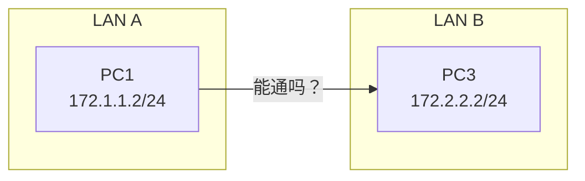
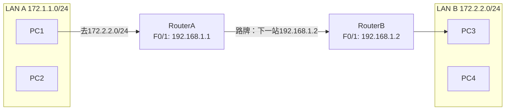
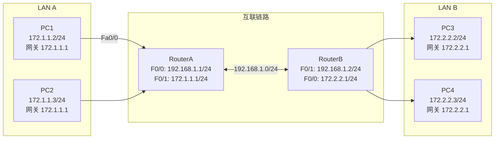
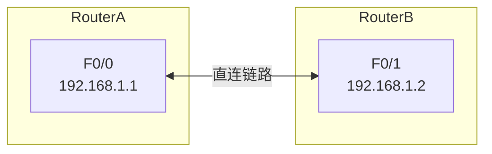
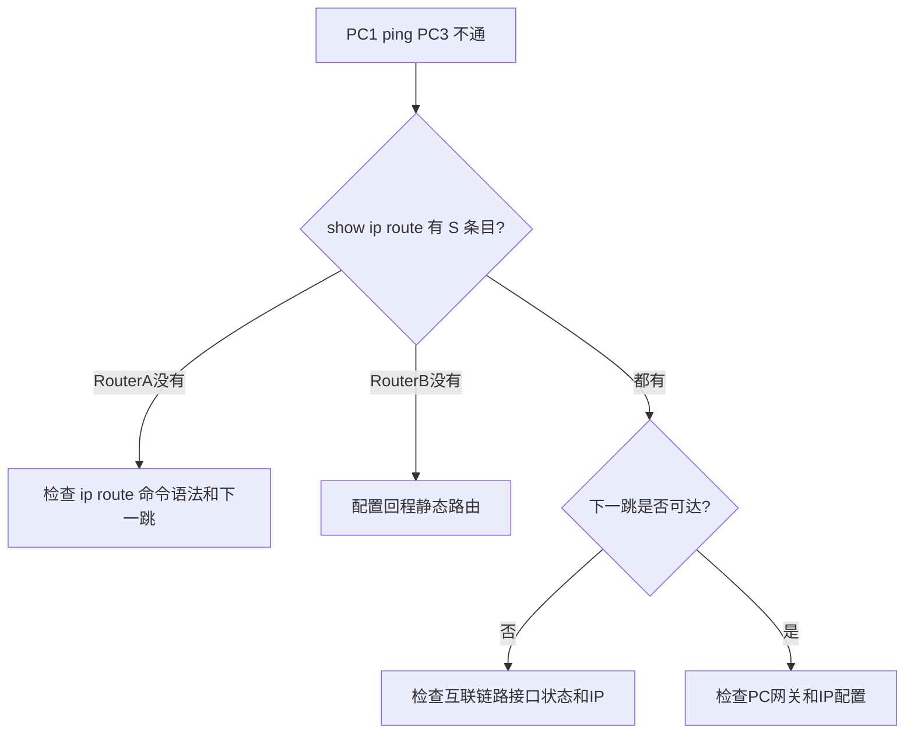

## 学习目标

学完本节后，学生能够：

- 说明路由表的作用，区分直连路由与静态路由
- 使用`ip route`命令配置静态路由和默认路由
- 选择正确的下一跳IP地址
- 使用`show ip route`、`ping`、`tracert`验证路由
- 根据ping失败现象排查缺少去程/回程路由

## 回顾：路由器基本配置之后学什么？

场景：两台路由器已经通过网线连接，各自的LAN也已配置好。



问题：

> 路由器接口都配好IP了，PC1能直接ping通PC3吗？

答案：**不能**。路由器只知道自己直连的网络，不知道远端LAN怎么走。

## 路由：网络世界的路牌系统

> Feynman类比：路由器像路口的交警，每个路口只认识自己直接连着的街道。要去陌生的街道，需要有人提前立好"路牌"——这就是路由表。



静态路由 = 管理员手工写的路牌。

## 实验拓扑



### 地址规划

| 设备 | 接口 | 网络 | IP地址 |
|---|---|---|---|
| RouterA | F0/0 | 192.168.1.0/24 | 192.168.1.1/24 |
| RouterA | F0/1 | 172.1.1.0/24 | 172.1.1.1/24 |
| RouterB | F0/1 | 192.168.1.0/24 | 192.168.1.2/24 |
| RouterB | F0/0 | 172.2.2.0/24 | 172.2.2.1/24 |
| PC1-PC2 | — | 172.1.1.0/24 | 172.1.1.0/24，网关 172.1.1.1 |
| PC3-PC4 | — | 172.2.2.0/24 | 172.2.2.0/24，网关 172.2.2.1 |

## 路由表初探

路由器启动后，路由表只有直连网络：

```txt
RouterA# show ip route

C 172.1.1.0/24 is directly connected, FastEthernet0/1
C 192.168.1.0/24 is directly connected, FastEthernet0/0
```

关键发现：

- `C` = Connected（直连路由）
- RouterA**不知道** 172.2.2.0/24 怎么走
- 所以 PC1 ping PC3 会被 RouterA 丢弃

## 配置静态路由

### 在 RouterA 上：去 LAN B 的路

```txt
RouterA(config)# ip route 172.2.2.0 255.255.255.0 192.168.1.2
RouterA(config)# end
RouterA# show ip route
```

含义：要去 172.2.2.0/24，下一跳交给 192.168.1.2（RouterB的F0/1）。

### 在 RouterB 上：去 LAN A 的路

```txt
RouterB(config)# ip route 172.1.1.0 255.255.255.0 192.168.1.1
RouterB(config)# end
RouterB# show ip route
```

含义：要去 172.1.1.0/24，下一跳交给 192.168.1.1（RouterA的F0/1）。

> ⚠️ **必须双向配置**，否则只有去程没有回程！

## 查看路由表

```txt
RouterA# show ip route

C 172.1.1.0/24 is directly connected, FastEthernet0/1
S 172.2.2.0/24 [1/0] via 192.168.1.2
C 192.168.1.0/24 is directly connected, FastEthernet0/0
```

字段解读：

| 字段 | 含义 |
|---|---|
| `S` | Static（静态路由） |
| `172.2.2.0/24` | 目标网络 |
| `[1/0]` | 管理距离/度量（AD=1，Metric=0） |
| `via 192.168.1.2` | 下一跳IP |

## Demo Checkpoint 1

### 预测输出

如果只配置了 RouterA 到 LAN B 的静态路由，未配置 RouterB 的回程路由，从 PC1 ping PC3 会出现什么现象？

A. 完全不通
B. 第一次通，后面不通
C. Request timeout（去程通，回程丢）

> 答案：**C** — 去程包能到PC3，但PC3的回复包到RouterB后找不到回172.1.1.0/24的路

## 下一跳怎么选？



规则：下一跳必须是**对端路由器与自己直连的那个接口**的IP。

| 要写静态路由的目标网络 | 下一跳应写 |
|---|---|
| 在RouterA上去 172.2.2.0/24 | 192.168.1.2（RouterB的F0/1） |
| 在RouterB上去 172.1.1.0/24 | 192.168.1.1（RouterA的F0/0） |

❌ 不要写自己的接口IP  
❌ 不要写目标网络中的某个PC地址

## 默认路由

当路由器不知道分组目的网络时，交给默认路由指定的下一跳：

```txt
RouterA(config)# ip route 0.0.0.0 0.0.0.0 192.168.1.2
```

适用场景：

- 企业边界路由器连接ISP
- 末梢网络（Stub Network）
- 减少路由表条目

> 默认路由是"兜底规则"：具体静态路由优先匹配，没有具体路由时才用它。

## 常见错误排查



## traceroute 看路径

在 PC1 上：

```txt
PC> tracert 172.2.2.2
```

预期输出：

```txt
Tracing route to 172.2.2.2 over a maximum of 30 hops:
  1   0 ms      0 ms      0 ms      172.1.1.1
  2   0 ms      0 ms      0 ms      172.2.2.2
Trace complete.
```

## 学生实验任务

🔵 基础任务：

- 完成 RouterA、RouterB 接口IP配置
- 配置双向静态路由
- 验证 PC1-PC4 互相ping通
- 截图`show ip route`

🟡 进阶任务：

- 在 RouterA 配置默认路由指向 RouterB
- 使用`tracert`观察数据包路径
- 思考：默认路由和具体静态路由哪个优先？

🔴 挑战任务：

- 添加第三台路由器，构建三路由器链式拓扑
- 配置静态路由实现三个LAN互通

## 思考点

1. 静态路由有什么优点？
2. 为什么两台路由器连上后，各自LAN不能自动互通？
3. 配置静态路由时，下一跳IP应该写谁的地址？
4. 如果只配了去程路由没配回程路由，会出现什么现象？
5. 默认路由与具体静态路由的优先级如何判断？

## 小结


今日要点：

- 静态路由 = 管理员手工指定的路牌
- `ip route 目标网段 掩码 下一跳IP`
- 双向静态路由缺一不可
- 默认路由`0.0.0.0 0.0.0.0`用于兜底

## 下节课预告

### 实验8 RIP协议

问题：

> 网络很大、路由器很多时，手工写静态路由太麻烦，怎么办？

答案：让路由器自动交换路由信息——动态路由协议。

预习：RIP协议工作原理、跳数、RIPv1与RIPv2的区别。
