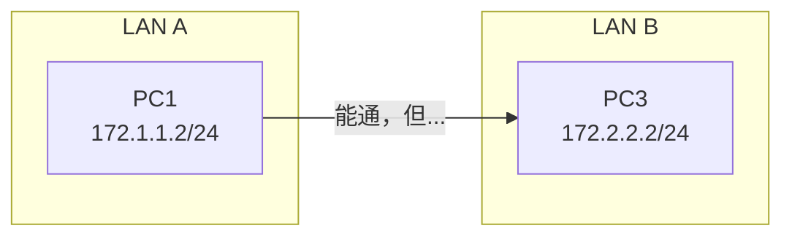
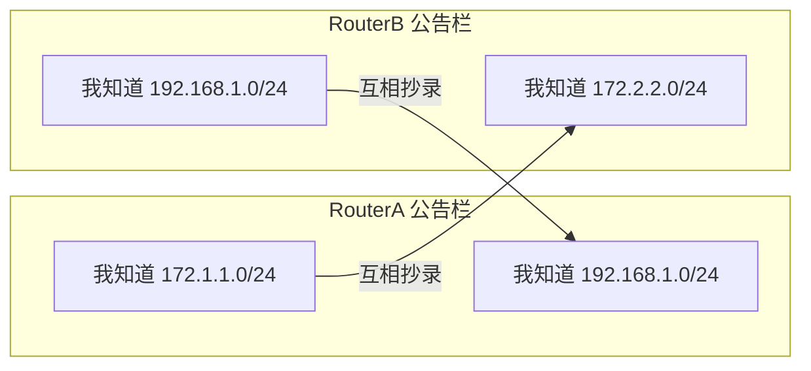
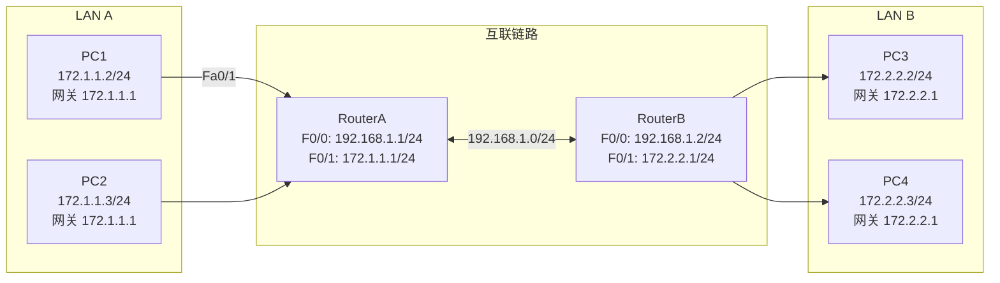
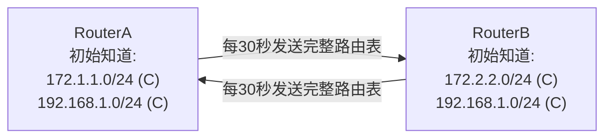
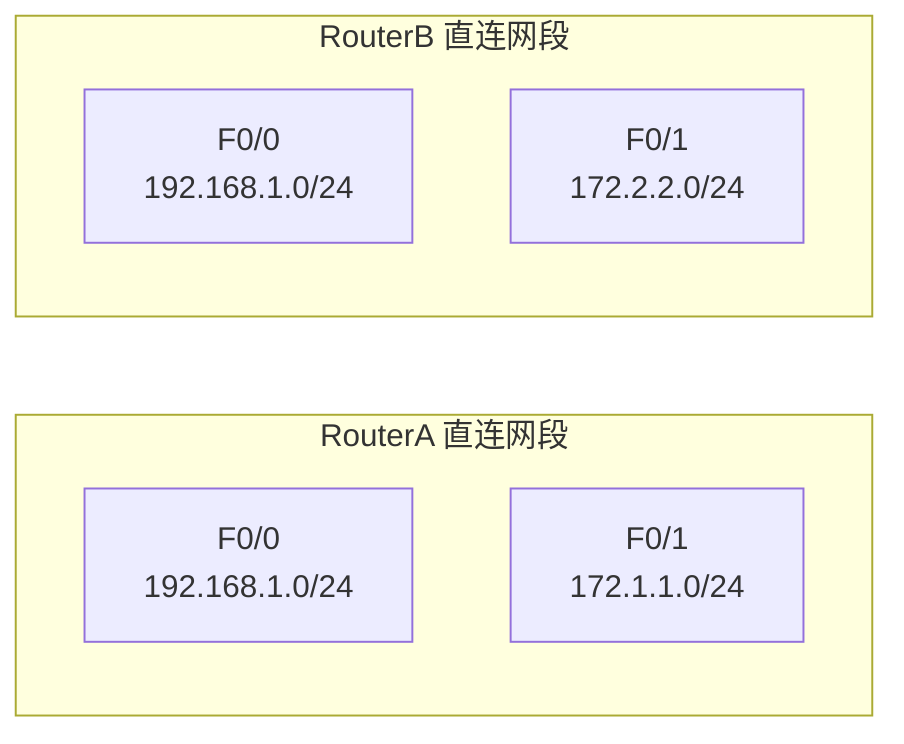
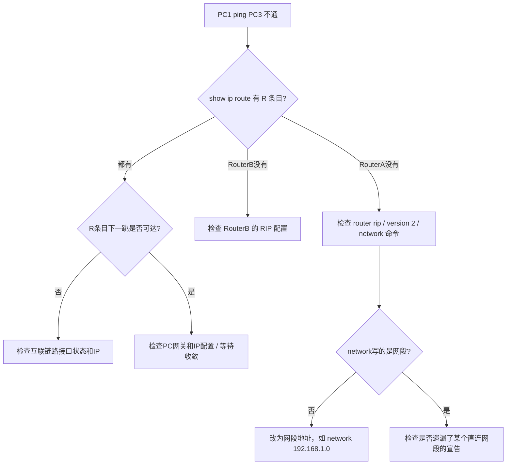

## 学习目标

学完本节后，学生能够：

- 说明RIP协议的工作原理（距离矢量、跳数、更新周期）
- 区分RIPv1与RIPv2的核心差异
- 使用`router rip`、`version 2`、`network`命令配置RIPv2
- 使用`show ip route`、`show ip protocols`、`ping`验证RIP路由
- 根据路由表输出判断路由来源（静态 vs RIP）并理解优先级差异

## 回顾：静态路由的痛点

场景：实验7中我们配置了两台路由器的静态路由。



问题：

> 如果网络扩大到10台路由器，每台路由器需要配置多少条静态路由？

答案：**90条**（每台要配到其他9个LAN的静态路由）。手工维护不可扩展！

## 动态路由：让路由器自动交换信息

> Feynman类比：路由器像小区里的楼长，每个楼长只认识自己楼和隔壁楼的路线。以前靠管理员手写路牌（静态路由），现在楼长们互相在公告栏上张贴自己知道的路线，大家互相抄录——这就是RIP协议。



RIP = 小区公告栏互相张贴路线。

## 实验拓扑



### 地址规划（与教材实验12一致）

| 设备 | 接口 | 网络 | IP地址 |
|---|---|---|---|
| RouterA | F0/0 | 192.168.1.0/24 | 192.168.1.1/24 |
| RouterA | F0/1 | 172.1.1.0/24 | 172.1.1.1/24 |
| RouterB | F0/0 | 192.168.1.0/24 | 192.168.1.2/24 |
| RouterB | F0/1 | 172.2.2.0/24 | 172.2.2.1/24 |
| PC1-PC2 | — | 172.1.1.0/24 | 172.1.1.0/24，网关 172.1.1.1 |
| PC3-PC4 | — | 172.2.2.0/24 | 172.2.2.0/24，网关 172.2.2.1 |

## RIP工作原理：距离矢量协议



关键特性：

- **距离矢量**：只告诉邻居"我知道这些网段，距离我几跳"
- **跳数（Hop Count）**：经过的路由器数量，最大15跳（16跳=不可达）
- **更新周期**：默认30秒广播/组播一次完整路由表
- **收敛**：所有路由器的路由表最终一致的过程

## RIPv1 vs RIPv2

| 特性 | RIPv1 | RIPv2 |
|---|---|---|
| 子网掩码 | 不发送 | **发送** |
| CIDR支持 | 不支持 | **支持** |
| 更新方式 | 广播（255.255.255.255） | **组播（224.0.0.9）** |
| 认证 | 不支持 | **支持明文/MD5认证** |
| 适用场景 | 简单同构网络 | 现代网络（推荐） |

> 结论：**always use `version 2`**

## 配置RIPv2

### 在 RouterA 上

```txt
RouterA> enable
RouterA# configure terminal
RouterA(config)# router rip
RouterA(config-router)# version 2
RouterA(config-router)# network 172.1.1.0
RouterA(config-router)# network 192.168.1.0
RouterA(config-router)# end
```

### 在 RouterB 上

```txt
RouterB> enable
RouterB# configure terminal
RouterB(config)# router rip
RouterB(config-router)# version 2
RouterB(config-router)# network 172.2.2.0
RouterB(config-router)# network 192.168.1.0
RouterB(config-router)# end
```

> ⚠️ **`network`后面写的是网段地址，不是接口IP！**
> - 正确：`network 192.168.1.0`
> - 错误：`network 192.168.1.1`

## 查看路由表：R条目出现

```txt
RouterA# show ip route

Codes: C - connected, S - static, R - RIP, M - mobile, B - BGP
...

C    172.1.1.0/24 is directly connected, FastEthernet0/1
R    172.2.2.0/24 [120/1] via 192.168.1.2, 00:00:15, FastEthernet0/0
C    192.168.1.0/24 is directly connected, FastEthernet0/0
```

字段解读：

| 字段 | 含义 |
|---|---|
| `R` | RIP协议学习到的路由 |
| `172.2.2.0/24` | 目标网络 |
| `[120/1]` | 管理距离/度量（AD=120，Metric=1跳） |
| `via 192.168.1.2` | 下一跳IP（RouterB的F0/0） |
| `00:00:15` | 距离上次更新15秒 |

对比静态路由：`S 172.2.2.0/24 [1/0]` — AD=1，说明静态路由优先级更高！

## Demo Checkpoint 1

### 预测输出

在RouterA和RouterB上都配置完RIP后，RouterA的`show ip route`中出现了：

```txt
R    172.2.2.0/24 [120/1] via 192.168.1.2
```

如果此时在RouterA上再手动添加一条静态路由：

```txt
RouterA(config)# ip route 172.2.2.0 255.255.255.0 192.168.1.2
```

那么`show ip route`中关于172.2.2.0/24会显示什么？

A. 只显示R条目
B. 只显示S条目
C. 同时显示S和R条目，但S条目生效
D. 同时显示S和R条目，但R条目生效

> 答案：**C** — 静态路由AD=1，RIP的AD=120，数值越小越优先，所以静态路由生效。但两条都会显示在路由表中。

## `network`命令怎么写？



规则：`network`宣告的是**直连网段**，不是接口IP。

| 路由器 | 接口 | 接口IP | 应宣告的network |
|---|---|---|---|
| RouterA | F0/0 | 192.168.1.1 | `network 192.168.1.0` |
| RouterA | F0/1 | 172.1.1.1 | `network 172.1.1.0` |
| RouterB | F0/0 | 192.168.1.2 | `network 192.168.1.0` |
| RouterB | F0/1 | 172.2.2.1 | `network 172.2.2.0` |

❌ 不要写`network 192.168.1.1`（接口IP）
❌ 不要写`network 172.1.1.1`（接口IP）

## 查看RIP协议状态

```txt
RouterA# show ip protocols

Routing Protocol is "rip"
  Sending updates every 30 seconds, next due in 12 seconds
  Invalid after 180 seconds, hold down 180, flushed after 240
  Outgoing update filter list for all interfaces is not set
  Incoming update filter list for all interfaces is not set
  Redistributing: rip
  Default version control: send version 2, receive version 2
    Interface             Send  Recv  Triggered RIP  Key-chain
    FastEthernet0/0       2     2     No             None
    FastEthernet0/1       2     2     No             None
  Automatic network summarization is not in effect
  Maximum path: 4
  Routing for Networks:
    172.1.1.0
    192.168.1.0
  Routing Information Sources:
    Gateway         Distance      Last Update
    192.168.1.2     120           00:00:15
  Distance: (default is 120)
```

关键信息：更新周期30秒、版本2、宣告的网段、邻居192.168.1.2。

## 常见错误排查



## 删除RIP与回退

如需删除RIP重新配置：

```txt
RouterA(config)# no router rip
```

这将删除所有RIP配置，路由表中的R条目会消失。

如需在保留RIP的情况下添加静态路由（静态优先）：

```txt
RouterA(config)# ip route 172.2.2.0 255.255.255.0 192.168.1.2
```

## 学生实验任务

🔵 基础任务：

- 完成 RouterA、RouterB 接口IP配置（复习实验7）
- 启动`router rip`，配置`version 2`
- 使用`network`宣告所有直连网段
- 验证 PC1-PC4 互相ping通
- 截图`show ip route`中的R条目

🟡 进阶任务：

- 对比RIPv1与RIPv2差异（填写对比表格）
- 使用`show ip protocols`查看RIP参数
- 思考：`[120/1]`中的120和1分别代表什么？

🔴 挑战任务：

- 添加第三台路由器RouterC，构建三路由器链式拓扑
- 配置RIP实现三个LAN互通
- 观察跳数变为2的现象
- 思考：RIP最大跳数15的限制会带来什么问题？

## 思考点

1. RIP协议有什么优点？与静态路由相比最大的区别是什么？
2. 为什么`network`命令后面要写网段地址而不是接口IP？
3. RIPv1和RIPv2的主要区别是什么？为什么实验中使用`version 2`？
4. `show ip route`输出中`[120/1]`表示什么？如果跳数变成16会怎样？
5. 如果网络中同时存在静态路由和RIP路由，路由器会优先选择哪一条？为什么？
6. RIP的更新周期是多少？配置完后为什么有时需要稍等才能ping通？

## 小结


今日要点：

- RIP = 距离矢量动态路由协议，基于跳数
- `router rip` → `version 2` → `network 网段`
- `network`宣告的是**直连网段**，不是接口IP
- R条目`[120/1]` = AD=120，Metric=1跳
- 静态路由AD=1优先于RIP的AD=120
- RIP最大15跳，16跳=不可达

## 下节课预告

### 实验9 OSPF协议

问题：

> RIP只根据跳数选路，不管带宽。如果一条路径经过2跳但带宽很低，另一条路径经过3跳但带宽很高，RIP会选哪条？

答案：RIP选2跳的（跳数少），但这不一定最优。

预习：OSPF协议工作原理、链路状态、Cost计算、区域概念。
