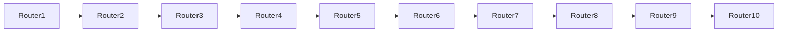
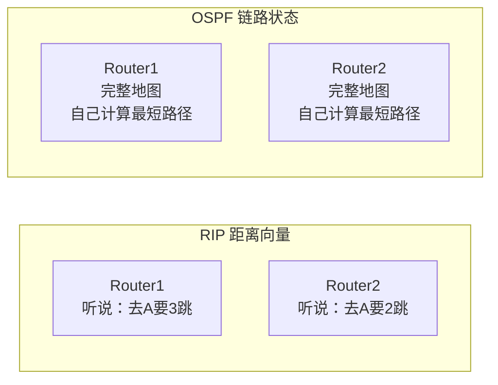
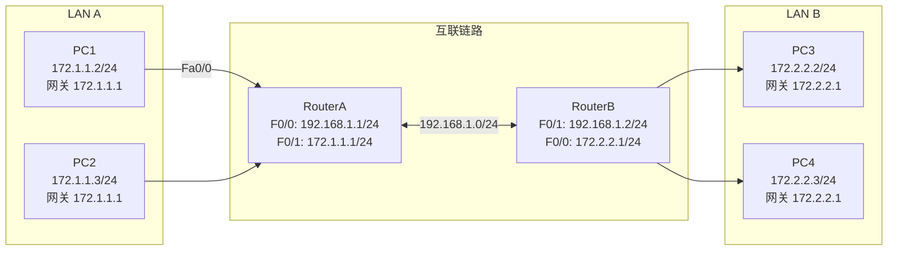
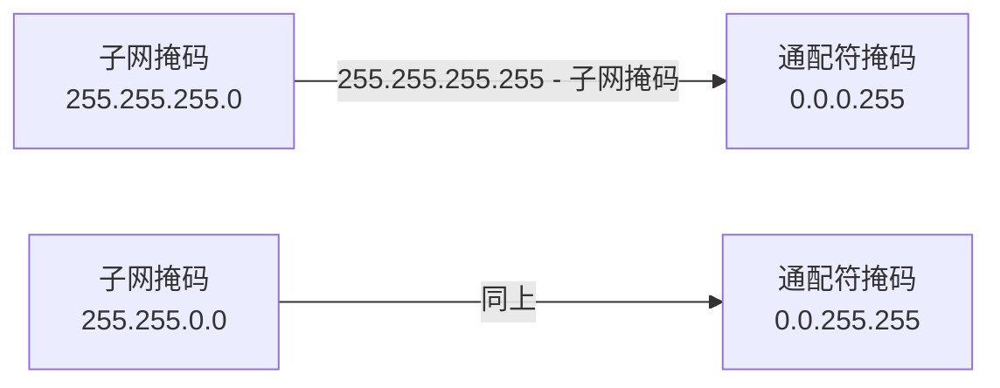
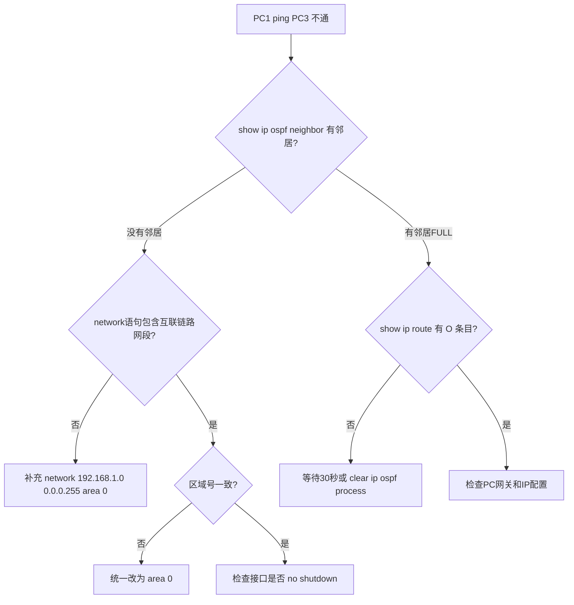
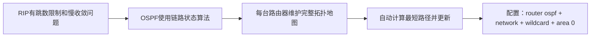

## 学习目标

学完本节后，学生能够：

- 说明OSPF链路状态工作原理，区分链路状态与距离向量
- 使用`router ospf`命令配置单区域OSPF
- 正确书写`network`命令和通配符掩码（wildcard mask）
- 使用`show ip route`、`show ip ospf neighbor`验证OSPF
- 对比OSPF与RIP在路由表输出、管理距离、度量方式上的差异

## 回顾：RIP协议有什么问题？

场景：企业网络有10台路由器，使用RIP协议。



问题：

> RIP最大跳数是多少？如果网络直径超过15跳会怎样？

答案：**RIP最大15跳，16跳视为不可达**。大网络中RIP无法工作。

RIP的其他问题：
- 慢收敛（30秒更新周期）
-  metric只看跳数，不看带宽
- 路由环路风险

## 路由协议：从"道听途说"到"自己画地图"

> Feynman类比：RIP像路人互相打听"到某地去要几站路"，信息层层传递容易失真；OSPF像每个路口都有一份完整的城市地图，自己计算最优路线。



| 特性 | RIP | OSPF |
|---|---|---|
| 算法类型 | 距离向量（Distance-Vector） | 链路状态（Link-State） |
| 度量标准 | 跳数（Hop Count） | 带宽/Cost |
| 更新方式 | 周期性广播整个路由表 | 触发更新+增量更新 |
| 收敛速度 | 慢（30秒周期） | 快（秒级） |
| 跳数限制 | 最大15跳 | 无限制 |
| 管理距离 | 120 | 110 |

## 实验拓扑



### 地址规划

| 设备 | 接口 | 网络 | IP地址 |
|---|---|---|---|
| RouterA | F0/0 | 192.168.1.0/24 | 192.168.1.1/24 |
| RouterA | F0/1 | 172.1.1.0/24 | 172.1.1.1/24 |
| RouterB | F0/1 | 192.168.1.0/24 | 192.168.1.2/24 |
| RouterB | F0/0 | 172.2.2.0/24 | 172.2.2.1/24 |
| PC1-PC2 | — | 172.1.1.0/24 | 172.1.1.0/24，网关 172.1.1.1 |
| PC3-PC4 | — | 172.2.2.0/24 | 172.2.2.0/24，网关 172.2.2.1 |

## 路由表初探（无OSPF时）

路由器启动后，路由表只有直连网络：

```txt
RouterA# show ip route

C 172.1.1.0/24 is directly connected, FastEthernet0/1
C 192.168.1.0/24 is directly connected, FastEthernet0/0
```

关键发现：

- `C` = Connected（直连路由）
- RouterA**不知道** 172.2.2.0/24 怎么走
- 所以 PC1 ping PC3 会被 RouterA 丢弃

> 静态路由需要管理员手工写；OSPF让路由器**自动交换地图**并计算最优路径。

## 配置OSPF：关键概念

## 1. 进程ID（Process ID）

```txt
RouterA(config)# router ospf 100
```

- 范围：1-65535
- **只在本地有意义**，不同路由器的进程ID可以不同
- 类比：公司内部的部门编号，不同公司可以重复

## 2. 通配符掩码（Wildcard Mask）

```txt
RouterA(config-router)# network 172.1.1.0 0.0.0.255 area 0
```

| 子网掩码 | 通配符掩码 | 计算方法 |
|---|---|---|
| 255.255.255.0 | 0.0.0.255 | 255 - 子网掩码每一位 |
| 255.255.0.0 | 0.0.255.255 | 同上 |
| 255.255.255.252 | 0.0.0.3 | 同上 |

> 口诀：**通配符掩码 = 子网掩码取反**（255.255.255.255 - 子网掩码）

## 3. 区域（Area）

- 单区域OSPF必须配置为 `area 0`（骨干区域）
- 类比：城市只有一个行政区，所有地图都归到同一个区管理

## 配置OSPF：RouterA

```txt
RouterA(config)# router ospf 100
RouterA(config-router)# network 172.1.1.0 0.0.0.255 area 0
RouterA(config-router)# network 192.168.1.0 0.0.0.255 area 0
RouterA(config-router)# end
RouterA# show ip ospf neighbor
```

含义：
- `router ospf 100`：启动OSPF进程，本地ID为100
- `network 172.1.1.0 0.0.0.255 area 0`：将172.1.1.0/24网段加入OSPF区域0
- `network 192.168.1.0 0.0.0.255 area 0`：将互联链路网段加入OSPF区域0

> ⚠️ **必须包含所有要参与OSPF的接口所在网段**，否则该网段不会被通告！

## 配置OSPF：RouterB

```txt
RouterB(config)# router ospf 100
RouterB(config-router)# network 172.2.2.0 0.0.0.255 area 0
RouterB(config-router)# network 192.168.1.0 0.0.0.255 area 0
RouterB(config-router)# end
RouterB# show ip ospf neighbor
```

含义：
- RouterB同样将两个直连网段加入OSPF区域0
- 两台路由器在192.168.1.0/24网段上发现彼此，建立邻居关系

## 查看OSPF邻居关系

```txt
RouterA# show ip ospf neighbor

Neighbor ID     Pri   State           Dead Time   Address         Interface
192.168.1.2       1   FULL/DR         00:00:39    192.168.1.2     FastEthernet0/0
```

字段解读：

| 字段 | 含义 |
|---|---|
| `Neighbor ID` | 邻居的Router ID（通常取最大IP） |
| `Pri` | 优先级（Priority） |
| `State` | 邻居状态：`FULL`表示完全同步 |
| `DR` | Designated Router（指定路由器） |
| `BDR` | Backup Designated Router（备份指定路由器） |
| `Dead Time` | 多久没收到Hello包认为邻居失效 |

> 在广播型网络（如以太网）中，OSPF会选举DR/BDR来减少邻接关系数量。本实验中只需知道`FULL`表示邻居正常建立。

## 查看路由表：OSPF自动学习

```txt
RouterA# show ip route

C 172.1.1.0/24 is directly connected, FastEthernet0/1
O 172.2.2.0/24 [110/74] via 192.168.1.2, 00:01:23, FastEthernet0/0
C 192.168.1.0/24 is directly connected, FastEthernet0/0
```

字段解读：

| 字段 | 含义 |
|---|---|
| `O` | OSPF（链路状态路由） |
| `172.2.2.0/24` | 目标网络（RouterB自动通告的） |
| `[110/74]` | 管理距离/度量（AD=110，Cost=74） |
| `via 192.168.1.2` | 下一跳IP |
| `00:01:23` | 路由已存在时间 |

对比RIP的路由表输出：

```txt
R 172.2.2.0/24 [120/1] via 192.168.1.2, 00:00:15, FastEthernet0/0
```

| 对比项 | OSPF | RIP |
|---|---|---|
| 路由代码 | `O` | `R` |
| 管理距离 | 110 | 120 |
| 度量值 | Cost（带宽相关） | Hop Count（跳数） |
| 路由时间 | 通常较短 | 30秒更新周期 |

## Demo Checkpoint 1

## 预测输出

如果RouterA配置了`network 172.1.1.0 0.0.0.255 area 0`，但**漏配了** `network 192.168.1.0 0.0.0.255 area 0`，从RouterA的`show ip ospf neighbor`会看到什么？

A. 邻居状态为FULL，但路由表没有O条目
B. 邻居状态为DOWN，没有邻居信息
C. 邻居状态为INIT，正在建立中

> 答案：**B** — 漏配互联链路网段后，RouterA不会在F0/0接口发送OSPF Hello包，无法发现RouterB，邻居状态为DOWN（无邻居信息）。

## 通配符掩码怎么算？



快速对照表：

| 前缀长度 | 子网掩码 | 通配符掩码 |
|---|---|---|
| /24 | 255.255.255.0 | 0.0.0.255 |
| /16 | 255.255.0.0 | 0.0.255.255 |
| /30 | 255.255.255.252 | 0.0.0.3 |
| /32 | 255.255.255.255 | 0.0.0.0 |

❌ 不要写 `255.255.255.0`（这是子网掩码）  
✅ 要写 `0.0.0.255`（这是通配符掩码）

> 记忆技巧：子网掩码中1表示"关注"，通配符掩码中0表示"关注"。两者相反！

## OSPF Cost：带宽决定优先级

OSPF使用Cost作为度量标准，Cost = 参考带宽 / 接口带宽。

```txt
RouterA# show ip ospf interface

FastEthernet0/0 is up, line protocol is up
  Internet Address 192.168.1.1/24, Area 0
  Process ID 100, Router ID 192.168.1.1, Network Type BROADCAST, Cost: 1
```

默认Cost值（参考带宽100Mbps）：

| 接口类型 | 带宽 | Cost |
|---|---|---|
| FastEthernet | 100 Mbps | 1 |
| Ethernet | 10 Mbps | 10 |
| Serial (T1) | 1.544 Mbps | 64 |

> 现代网络中千兆口Cost也是1（因为参考带宽只有100M），实际工程中可能需要调整参考带宽。

## 常见错误排查



## 学生实验任务

🔵 基础任务：

- 完成 RouterA、RouterB 接口IP配置
- 配置OSPF单区域（area 0），使PC1-PC4互相ping通
- 截图`show ip route`（含O条目）和`show ip ospf neighbor`

🟡 进阶任务：

- 查看`show ip ospf interface`记录Cost值
- 对比OSPF与RIP的路由表输出差异，填写协议对比表
- 思考：为什么OSPF的管理距离（110）比RIP（120）更优？

🔴 挑战任务：

- 添加第三台路由器，构建三路由器链式拓扑
- 配置OSPF实现三个LAN互通
- 观察DR/BDR选举结果（`show ip ospf neighbor`）

## 思考点

1. OSPF与RIP相比有哪些优势？
2. 通配符掩码和子网掩码有什么区别？
3. OSPF的进程ID（如100）是否必须在所有路由器上相同？
4. 为什么单区域OSPF必须配置area 0？
5. `show ip route`中`[110/74]`的110和74分别表示什么？
6. 如果两台路由器的区域号不一致（一台area 0，一台area 1），会出现什么现象？

## 小结



今日要点：

- OSPF = 链路状态协议，每台路由器都有完整网络地图
- `router ospf 进程ID`启动OSPF
- `network 网段 通配符掩码 area 0` 将接口加入OSPF
- 通配符掩码 = 子网掩码取反（/24对应0.0.0.255）
- `show ip ospf neighbor`查看邻居，`show ip route`查看O条目
- OSPF管理距离110，优于RIP的120

## 下节课预告

### 实验10 标准ACL

问题：

> 网络已经通了，但如何控制谁能访问谁？

答案：使用访问控制列表（ACL）过滤流量。

预习：标准ACL与扩展ACL的区别，ACL的放置位置原则。
