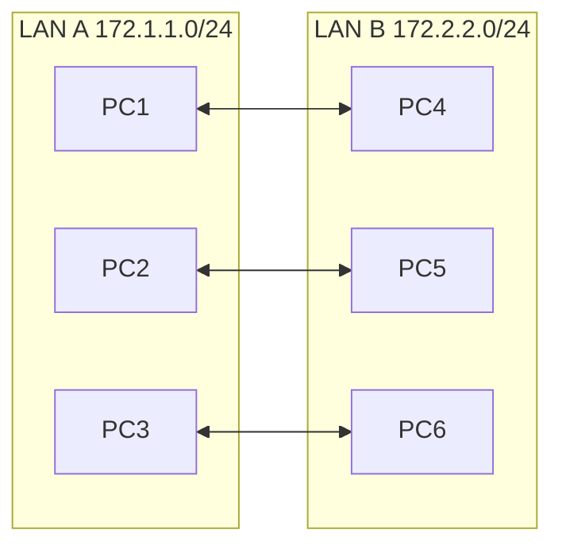
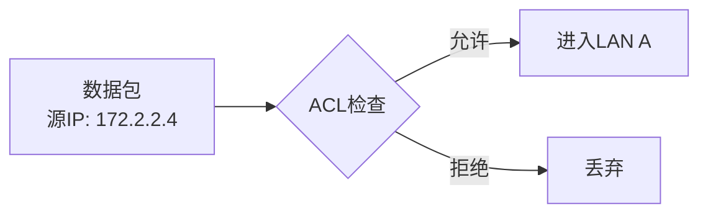
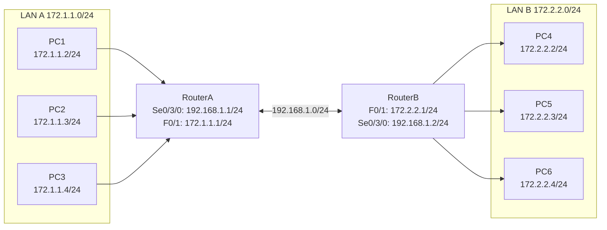
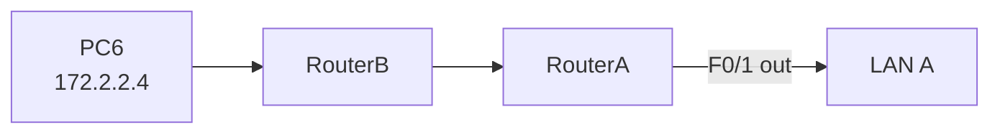
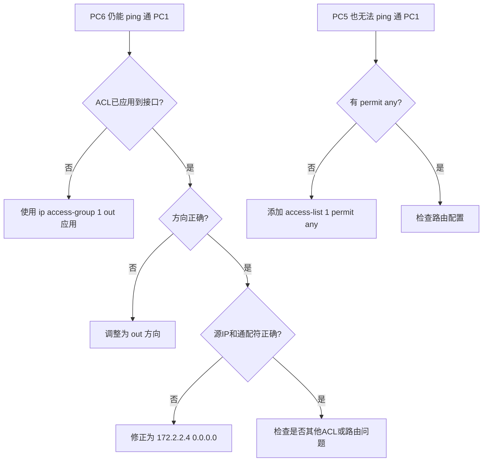

## 学习目标

学完本节后，学生能够：

- 说明ACL的作用和工作原理
- 区分标准ACL与扩展ACL
- 配置标准ACL（1-99）过滤基于源IP的流量
- 将ACL应用到接口的in/out方向
- 使用`show access-lists`验证ACL效果

## 回顾：网络通了之后还有什么问题？

场景：使用RIP或OSPF，LAN A和LAN B的所有PC已经互通。



问题：

> 现在所有PC都能互相访问。如果只想禁止PC6访问LAN A，怎么办？

答案：使用访问控制列表（ACL）。

## ACL：网络世界的门卫

> Feynman类比：ACL像大楼的门卫或小区门禁。每个人（数据包）进门时，门卫检查其身份证（源IP），决定放行还是拒绝。



ACL = Access Control List，访问控制列表。

## 标准ACL vs 扩展ACL

| 特性 | 标准ACL | 扩展ACL |
|---|---|---|
| 编号范围 | 1-99 | 100-199 |
| 过滤依据 | 源IP | 源IP、目的IP、协议、端口 |
| 放置位置 | 靠近目的地 | 靠近源 |
| 复杂度 | 简单 | 复杂 |
| 应用场景 | 快速隔离某个源 | 精细控制某种服务 |

本节课先学习**标准ACL**。

## 实验拓扑



### 地址规划

| 设备 | 接口 | IP地址 |
|---|---|---|
| RouterA | Se0/3/0 | 192.168.1.1/24 |
| RouterA | F0/1 | 172.1.1.1/24 |
| RouterB | F0/1 | 172.2.2.1/24 |
| RouterB | Se0/3/0 | 192.168.1.2/24 |
| PC1-PC3 | — | 172.1.1.0/24，网关 172.1.1.1 |
| PC4-PC6 | — | 172.2.2.0/24，网关 172.2.2.1 |

## 实验要求

**目标：禁止主机PC6（172.2.2.4）访问 172.1.1.0/24 网段。**

要求：

1. 先配置RIP或OSPF，使所有PC互通。
2. 在RouterA上配置标准ACL。
3. 应用到合适的接口和方向。
4. 验证PC6无法访问LAN A，但其他PC可以。

## 标准ACL配置

## 在 RouterA 上

```txt
RouterA(config)# access-list 1 deny 172.2.2.4 0.0.0.0
RouterA(config)# access-list 1 permit any
RouterA(config)# interface fastethernet 0/1
RouterA(config-if)# ip access-group 1 out
RouterA(config-if)# end
```

命令解读：

| 命令 | 含义 |
|---|---|
| `access-list 1` | 标准ACL，编号1 |
| `deny 172.2.2.4 0.0.0.0` | 拒绝源IP为172.2.2.4（PC6）的流量 |
| `permit any` | 允许其他所有流量 |
| `ip access-group 1 out` | 在F0/1接口的出方向应用ACL 1 |

> ⚠️ **ACL末尾默认有隐式 deny any**，所以必须显式写`permit any`！

## 为什么放在 RouterA F0/1 的 out 方向？



标准ACL只能根据源IP过滤。如果放在靠近源的位置（RouterB），可能会误伤PC6访问其他网络的流量。

因此标准ACL应**靠近目的地**放置，避免误伤。

| 放置位置 | 方向 | 效果 |
|---|---|---|
| RouterA F0/1 | out | ✅ 只阻止进入LAN A，不影响PC6去其他地方 |
| RouterB F0/1 | in | ❌ 会阻止PC6的所有出站流量，包括去其他合法网络 |

## 验证ACL效果

## 查看ACL

```txt
RouterA# show access-lists

Standard IP access list 1
    10 deny 172.2.2.4 (5 match(es))
    20 permit any (15 match(es))
```

## ping测试

| 测试 | 预期结果 | 说明 |
|---|---|---|
| PC6 ping PC1 | 失败 | ACL匹配deny规则 |
| PC6 ping PC2 | 失败 | 同上 |
| PC5 ping PC1 | 成功 | ACL permit any |
| PC4 ping PC3 | 成功 | ACL permit any |

## Demo Checkpoint 1

## 预测输出

如果标准ACL配置如下：

```txt
access-list 1 deny 172.2.2.4 0.0.0.0
```

没有写`access-list 1 permit any`，就应用到接口。此时PC5 ping PC1会怎样？

A. 成功
B. 失败
C. 有时成功有时失败

> 答案：**B** — ACL末尾隐式deny any，没有显式permit any时，所有流量都被拒绝。

## 通配符掩码速查

| 要匹配的地址 | 通配符掩码 | 含义 |
|---|---|---|
| 单个主机 172.2.2.4 | `0.0.0.0` | 每一位都必须匹配 |
| 整个网段 172.2.2.0/24 | `0.0.0.255` | 前24位匹配，后8位任意 |
| 任意地址 | `255.255.255.255` | 所有位都不检查 |

也可以写成：

```txt
access-list 1 deny host 172.2.2.4
! 等价于
access-list 1 deny 172.2.2.4 0.0.0.0
```

## 常见错误排查



## 删除ACL

正确顺序：

```txt
RouterA(config)# interface fastethernet 0/1
RouterA(config-if)# no ip access-group 1 out
RouterA(config-if)# exit
RouterA(config)# no access-list 1
```

> 如果直接从接口移除ACL但未删除access-list，配置仍然保留在 running-config 中。

## 学生实验任务

🔵 基础任务：

- 配置RIP或OSPF，使所有PC互通
- 配置标准ACL禁止PC6访问172.1.1.0/24网段
- 将ACL应用到RouterA F0/1接口out方向
- 验证PC6被隔离，其他PC正常
- 截图`show access-lists`

🟡 进阶任务：

- 使用`show access-lists`观察匹配计数变化
- 理解隐式deny any
- 讨论：为什么标准ACL要靠近目的地？

🔴 挑战任务：

- 配置标准ACL禁止整个172.2.2.0/24网段访问172.1.1.0/24
- 但允许172.2.2.0/24访问其他网络
- 分析放置位置对流量的影响

## 思考点

1. ACL在哪些场合会用到？
2. 标准ACL和扩展ACL的主要区别是什么？
3. 为什么标准ACL建议放在靠近目的地的地方？
4. 如果忘记写`permit any`会出现什么后果？
5. `ip access-group 1 out`中的out方向是什么意思？
6. 如何查看ACL的匹配次数？

## 小结


今日要点：

- ACL = 访问控制列表，决定流量允许/拒绝
- 标准ACL编号1-99，只根据源IP过滤
- 标准ACL应靠近目的地放置
- 必须显式写`permit any`，否则隐式deny any拒绝所有
- `show access-lists`查看匹配计数

## 下节课预告

### 实验11 扩展ACL

问题：

> 标准ACL只能根据源IP过滤。如果想"只允许PC1访问PC3的Web服务，但禁止PC1访问PC3的FTP"，怎么办？

答案：使用扩展ACL，可以基于源IP、目的IP、协议、端口进行精细控制。

预习：扩展ACL编号、协议关键字、端口号、放置位置。
