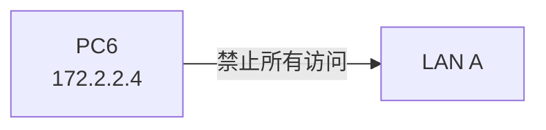
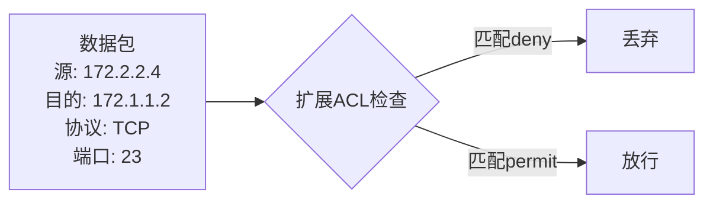
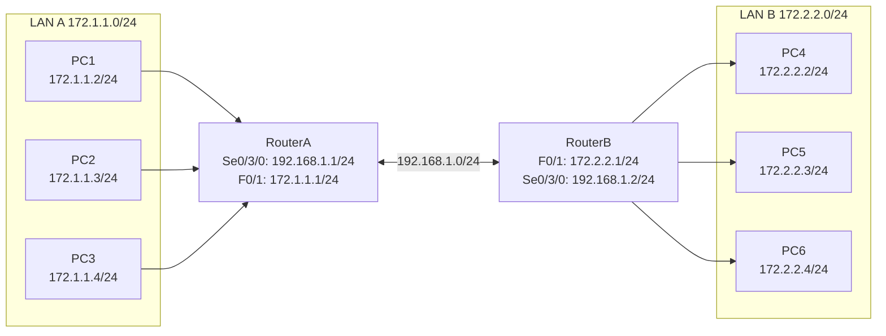
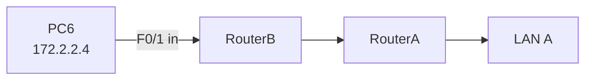
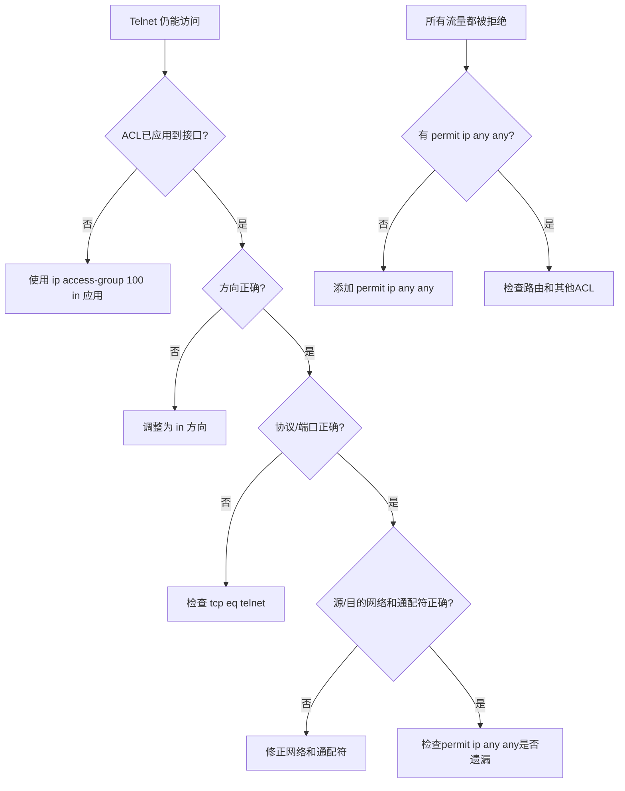

## 学习目标

学完本节后，学生能够：

- 说明扩展ACL与标准ACL的区别
- 配置扩展ACL（100-199）基于源IP、目的IP、协议、端口过滤
- 理解扩展ACL应靠近源放置
- 使用`show access-lists`验证扩展ACL效果
- 排查扩展ACL配置中的常见错误

## 回顾：标准ACL的局限

场景：使用标准ACL禁止PC6访问LAN A。



问题：

> 如果只想禁止PC6访问LAN A的Telnet，但允许PC6访问LAN A的HTTP，标准ACL能做到吗？

答案：**不能**。标准ACL只能根据源IP过滤，无法区分服务类型。

## 扩展ACL：智能安检系统

> Feynman类比：标准ACL像门卫只看身份证；扩展ACL像机场安检，不仅看你是谁，还要看你要去哪、坐什么交通工具、带什么行李。



扩展ACL可以根据：

- 源IP地址
- 目的IP地址
- 协议类型（TCP/UDP/IP/ICMP）
- 端口号（Telnet/HTTP/FTP/DNS等）

## 标准ACL vs 扩展ACL

| 特性 | 标准ACL | 扩展ACL |
|---|---|---|
| 编号范围 | 1-99 | 100-199 |
| 过滤维度 | 源IP | 源IP、目的IP、协议、端口 |
| 放置位置 | 靠近目的地 | 靠近源 |
| 语法复杂度 | 简单 | 较复杂 |
| 粒度 | 粗 | 细 |

## 实验拓扑



## 实验要求

**目标：禁止 LAN B（172.2.2.0/24）访问 LAN A（172.1.1.0/24）的 Telnet 服务，但允许其他流量。**

要求：

1. 先配置RIP或OSPF，使所有PC互通。
2. 在RouterB上配置扩展ACL。
3. 应用到合适的接口和方向。
4. 验证：LAN B的PC无法Telnet到LAN A，但可以ping通LAN A。

## 扩展ACL配置

## 在 RouterB 上

```txt
RouterB(config)# access-list 100 deny tcp 172.2.2.0 0.0.0.255 172.1.1.0 0.0.0.255 eq telnet
RouterB(config)# access-list 100 permit ip any any
RouterB(config)# interface fastethernet 0/1
RouterB(config-if)# ip access-group 100 in
RouterB(config-if)# end
```

命令解读：

| 部分 | 含义 |
|---|---|
| `access-list 100` | 扩展ACL，编号100 |
| `deny tcp` | 拒绝TCP协议 |
| `172.2.2.0 0.0.0.255` | 源地址：LAN B |
| `172.1.1.0 0.0.0.255` | 目的地址：LAN A |
| `eq telnet` | 端口号等于Telnet（23） |
| `permit ip any any` | 允许其他所有IP流量 |
| `ip access-group 100 in` | 在F0/1接口in方向应用ACL |

## 为什么放在 RouterB F0/1 的 in 方向？



扩展ACL应**靠近源**放置：

- 在RouterB的F0/1 in方向应用，可以在流量进入RouterB时就阻止。
- 避免不必要的流量占用WAN链路带宽。

| 放置位置 | 方向 | 效果 |
|---|---|---|
| RouterB F0/1 | in | ✅ 在源头阻止，节省带宽 |
| RouterA F0/1 | out | ❌ 流量已穿越WAN链路，浪费带宽 |

## 验证扩展ACL效果

## 查看ACL

```txt
RouterB# show access-lists

Extended IP access list 100
    10 deny tcp 172.2.2.0 0.0.0.255 172.1.1.0 0.0.0.255 eq telnet (3 match(es))
    20 permit ip any any (25 match(es))
```

## 测试

| 测试 | 预期结果 | 说明 |
|---|---|---|
| PC6 telnet 172.1.1.2 | 失败 | ACL deny匹配 |
| PC6 ping 172.1.1.2 | 成功 | permit ip any any |
| PC6 ping PC5 | 成功 | 不涉及LAN A |
| PC4 telnet 172.1.1.3 | 失败 | ACL deny匹配 |
| PC4 ping 172.1.1.3 | 成功 | permit ip any any |

## Demo Checkpoint 1

## 预测输出

扩展ACL配置如下：

```txt
access-list 100 deny tcp 172.2.2.0 0.0.0.255 172.1.1.0 0.0.0.255 eq telnet
access-list 100 permit ip any any
```

应用到RouterB F0/1 in方向。此时PC6执行`ping 172.1.1.2`，结果如何？

A. 失败，因为扩展ACL拒绝了所有流量
B. 成功，因为ping使用ICMP，不匹配deny tcp规则
C. 失败，因为ACL应用到了in方向

> 答案：**B** — ping使用ICMP协议，而ACL只deny了tcp eq telnet，所以ping被permit ip any any放行。

## 常用协议与端口

| 服务 | 协议 | 端口 | ACL写法 |
|---|---|---|---|
| Telnet | TCP | 23 | `eq telnet` 或 `eq 23` |
| HTTP | TCP | 80 | `eq www` 或 `eq 80` |
| HTTPS | TCP | 443 | `eq 443` |
| FTP 控制 | TCP | 21 | `eq ftp` 或 `eq 21` |
| FTP 数据 | TCP | 20 | `eq ftp-data` 或 `eq 20` |
| DNS | UDP/TCP | 53 | `eq domain` 或 `eq 53` |
| SMTP | TCP | 25 | `eq smtp` 或 `eq 25` |
| ICMP | ICMP | — | `permit icmp` |

## 常见错误排查



## 删除扩展ACL

正确顺序：

```txt
RouterB(config)# interface fastethernet 0/1
RouterB(config-if)# no ip access-group 100 in
RouterB(config-if)# exit
RouterB(config)# no access-list 100
```

## 学生实验任务

🔵 基础任务：

- 配置RIP或OSPF，使所有PC互通
- 在RouterB上配置扩展ACL，禁止LAN B访问LAN A的Telnet
- 应用到RouterB F0/1 in方向
- 验证：Telnet失败，ping成功
- 截图`show access-lists`

🟡 进阶任务：

- 配置扩展ACL只允许LAN B访问LAN A的HTTP（TCP 80），禁止Telnet
- 验证：HTTP通，Telnet不通，ping通
- 观察`show access-lists`匹配计数

🔴 挑战任务：

- 配置复杂ACL：允许LAN B访问LAN A的HTTP和DNS，禁止Telnet和FTP
- 讨论：如果同时存在标准ACL和扩展ACL，哪个优先？

## 思考点

1. 扩展ACL相比标准ACL有什么优势？
2. 为什么扩展ACL建议放在靠近源的地方？
3. 扩展ACL语法中`eq telnet`可以用什么代替？
4. 如果忘记写`permit ip any any`会出现什么后果？
5. 标准ACL和扩展ACL的编号范围分别是多少？
6. 如何测试Telnet是否被ACL阻止？

## 小结


今日要点：

- 扩展ACL编号100-199，过滤维度更丰富
- 语法：`access-list 100 deny tcp 源 通配符 目的 通配符 eq 端口`
- 扩展ACL应靠近源放置，节省带宽
- 必须写`permit ip any any`，否则隐式deny拒绝所有
- 使用`show access-lists`查看匹配计数

## 下节课预告

### 实验12 网络地址转换（NAT）

问题：

> 私网地址为什么不能直接上公网？公司几十台电脑如何共用一个公网IP上网？

答案：使用NAT技术将私网地址转换为公网地址。

预习：NAT工作原理、静态NAT/动态NAT/NAPT、inside/outside接口。
