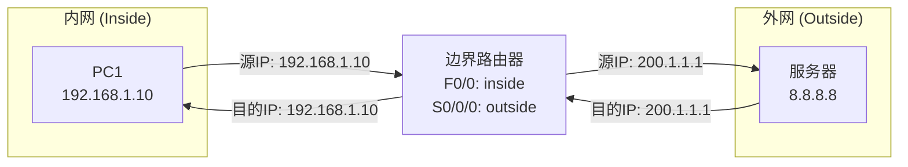
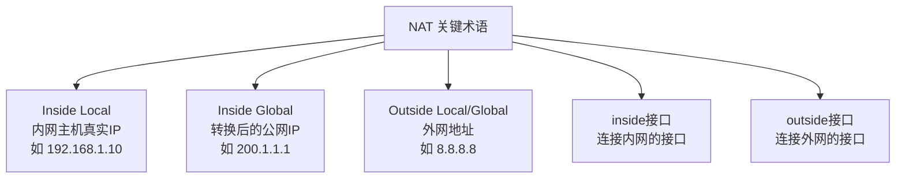
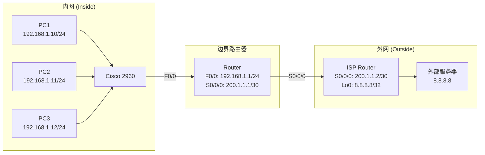

## 学习目标

学完本实验后，学生能够：

- 说明 NAT 三种工作方式的原理与区别。
- 在路由器上配置静态 NAT、动态 NAT、NAPT。
- 正确标记 inside/outside 接口。
- 使用 `show ip nat translations` 诊断 NAT 故障。
- 理解 NAT 对 IPv4 地址枯竭的缓解作用及局限性。

## 问题引入

### 私网地址能上公网吗？

RFC 1918 私有地址范围：

- `10.0.0.0/8`
- `172.16.0.0/12`
- `192.168.0.0/16`

这些地址在互联网上**不可路由**。

问题：你的电脑（`192.168.x.x`）是怎么上网的？

答案：通过 NAT 技术将私网地址转换为公网地址。

## NAT = 公司前台

> Feynman 类比：NAT 就像公司前台代收邮件。外部只看到公司总机号码，不知道内部分机号。



## 三种 NAT 方式

| 方式 | 映射关系 | 类比 | 公网 IP 需求 |
|---|---|---|---|
| 静态 NAT | 一对一固定 | VIP 专线 | = 内网主机数 |
| 动态 NAT | 多对多动态 | 共享工位 | < 内网主机数 |
| **NAPT/PAT** | **多对一复用** | **分机系统** | **1 个就够** |

> NAPT 最常用！期末考试重点！

## 关键概念



## 实验拓扑



### 地址规划

| 设备 | 接口 | IP 地址 | 网关 |
|---|---|---|---|
| PC1 | — | `192.168.1.10/24` | `192.168.1.1` |
| PC2 | — | `192.168.1.11/24` | `192.168.1.1` |
| PC3 | — | `192.168.1.12/24` | `192.168.1.1` |
| Router | F0/0 | `192.168.1.1/24` | — |
| Router | S0/0/0 | `200.1.1.1/30` | — |
| ISP Router | S0/0/0 | `200.1.1.2/30` | — |
| ISP Router | Lo0 | `8.8.8.8/32` | — |

## 静态 NAT 配置

### 一对一固定映射

```txt
! 标记接口角色
Router(config)# interface f0/0
Router(config-if)# ip nat inside
Router(config-if)# exit
Router(config)# interface s0/0/0
Router(config-if)# ip nat outside
Router(config-if)# exit

! 配置一对一映射
Router(config)# ip nat inside source static 192.168.1.10 200.1.1.10
```

验证：

```txt
Router# show ip nat translations
```

## 动态 NAT 配置

### 地址池动态分配

```txt
! 标记接口角色（同静态NAT）
Router(config)# interface f0/0
Router(config-if)# ip nat inside
Router(config)# interface s0/0/0
Router(config-if)# ip nat outside

! 定义地址池
Router(config)# ip nat pool MY_POOL 200.1.1.10 200.1.1.20 netmask 255.255.255.0

! 定义哪些内网地址可以转换
Router(config)# access-list 1 permit 192.168.1.0 0.0.0.255

! 绑定ACL和地址池
Router(config)# ip nat inside source list 1 pool MY_POOL
```

> ⚠️ 地址池 IP 数量有限，内网主机多时会耗尽！

## NAPT 配置

### 一个关键字改变一切

```txt
! 标记接口角色
Router(config)# interface f0/0
Router(config-if)# ip nat inside
Router(config)# interface s0/0/0
Router(config-if)# ip nat outside

! 定义ACL匹配感兴趣流量
Router(config)# access-list 1 permit 192.168.1.0 0.0.0.255

! 启用端口复用（overload关键字是关键）
Router(config)# ip nat inside source list 1 interface s0/0/0 overload
```

| 无 overload | 有 overload |
|---|---|
| 动态 NAT（一对一） | NAPT（多对一） |
| 2 个公网 IP → 最多 2 台 PC 上网 | 1 个公网 IP → 所有 PC 上网 |
| 转换表只有 IP | 转换表有 IP + **端口号** |

## 课堂测验

### 预测输出

配置 NAPT 后，三台 PC 同时 ping `8.8.8.8`，`show ip nat translations` 会显示几条记录？

A. 1 条（因为只有一个公网 IP）  
B. 3 条（每台 PC 一条，端口号不同）  
C. 0 条（NAPT 不支持 ping）

> 答案：**B** — 每条 ICMP 会话分配不同端口号。

## 验证命令

### `show ip nat translations`

```txt
Router# show ip nat translations

Pro  Inside global      Inside local       Outside local      Outside global
icmp 200.1.1.1:1024     192.168.1.10:1024  8.8.8.8:8          8.8.8.8:8
icmp 200.1.1.1:1025     192.168.1.11:1024  8.8.8.8:8          8.8.8.8:8
tcp  200.1.1.1:5000     192.168.1.12:80    1.1.1.1:80         1.1.1.1:80
```

颜色标注：

- 🔵 Inside Local = 内网真实地址
- 🟢 Inside Global = 转换后的地址
- 注意端口号的变化！

## 常见错误排查


## NAT 检查清单

- [ ] 接口标记：inside + outside
- [ ] ACL 定义：匹配需转换的内网流量
- [ ] NAT 绑定：pool + ACL（动态）或 直接映射（静态）
- [ ] `overload` 关键字（NAPT 必须）
- [ ] 路由配置：确保转换后的包能到达目的地
- [ ] 验证：`ping` + `show ip nat translations`

**期末考试提醒：** NAT 配置占 20 分，需独立完成完整网络中的 NAT 部署。

## 学生实验任务

🔵 **基础任务：**

- 打开实验拓扑文件。
- 配置 NAPT 使三台 PC 都能 ping 通 `8.8.8.8`。
- 截图 `show ip nat translations` 输出。

🟡 **进阶任务：**

- 删除 `overload`，观察现象并记录。
- 配置静态 NAT 使 PC1 固定使用 `200.1.1.10`。
- 对比三种方式的转换表。

🔴 **挑战任务：**

- 内部 Web 服务器端口映射。
- 思考：NAT 对 P2P 应用（如 BT 下载）有什么影响？

## 思考点

1. NAT 的作用是什么？为什么要用 NAT 技术？
2. 静态 NAT、动态 NAT、NAPT 各适用于什么场景？
3. `ip nat inside` 和 `ip nat outside` 标反会出现什么现象？
4. NAPT 如何通过一个公网 IP 让多台内网主机同时上网？
5. NAT 和路由有什么区别？
6. NAT 有哪些局限性？

## 小结


今日要点：

- NAT 缓解 IPv4 地址枯竭。
- NAPT 通过一个公网 IP + 端口号让多台内网主机上网。
- inside/outside 方向标记是关键。
- `overload` 是 NAPT 的灵魂。
- 期末考试 NAT 配置占 20 分。

## 课程总结

12 个实验全部完成：

从网络命令 → 子网划分 → 交换机 → VLAN → 三层交换 → 路由器 → 静态/RIP/OSPF 路由 → 标准/扩展 ACL → NAT。

期末综合网络设计将融合以上全部技能。

预习：回顾全部 12 个实验，准备期末课程报告。

## Summary

本实验围绕网络地址转换（NAT）展开，重点讲解并实操静态 NAT、动态 NAT 与 NAPT 三种方式。学生需掌握 inside/outside 接口标记、ACL 与 NAT 的绑定关系，以及 `overload` 关键字在 NAPT 中的核心作用。通过拓扑配置与 `show ip nat translations` 验证，学生应能独立部署 NAT，并具备排查常见配置错误的能力。
